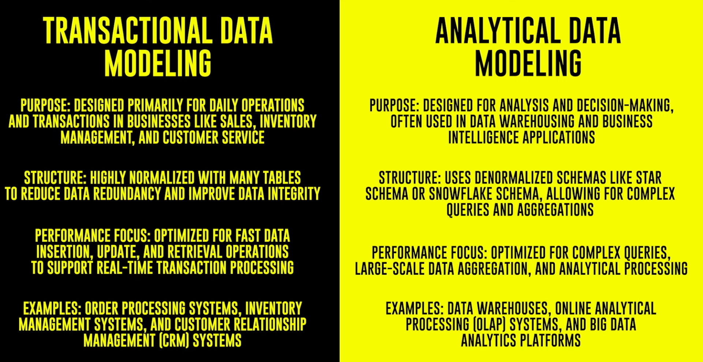

# Roadmap to become an Azure Data Engineer

## Stage 1: SQL and Python

### WHY SQL?

SQL is important for data engineers because it helps them easily organize, retrieve, and work with information stored in databases.

#### SQL Steps

1. Watch the video below to receive a fundamental introduction to SQL, spending 4 hours
   to become familiar with its syntax and concepts.

   [SQL Tutorial for Beginners [Ultimate Full Course] - From Zero to HERO](https://youtube.com/playlist?list=PLNcg_FV9n7qZDdRInCl7wfOO8yZqYX5hO&si=1VKq9-v1hvERVyXJ) by [Data with Baraa](https://www.youtube.com/@DataWithBaraa)

2. [Advanced SQL Course | For Data Analytics](https://youtube.com/playlist?list=PLNcg_FV9n7qZY_2eAtUzEUulNjTJREhQe&si=bB5Ky64QNPlqRD2f) by [Data with Baraa](https://www.youtube.com/@DataWithBaraa) on YouTube

3. [Practice as much as possible using W3 Schools](https://www.w3schools.com/sql/)

   Practice is the Key- if you are absolute beginner spend 15 days to learn SQL.

4. [Intuitive SQL For Data Analytics - Tutorial](https://youtu.be/mXW7JHJM34k?si=TEq4xCeAbJXvGmOT) by [Vlad Gheorghe](https://www.youtube.com/channel/UCPTHkTRS4ohdVONhHhu-kQg) on YouTube

### WHY PYTHON?

Python is crucial for data engineers because it offers a versatile and readable programming
language with extensive libraries, facilitating efficient data manipulation and analysis in various data engineering tasks.

#### Python Steps

1. Watch the awesome video below to receive a basic introduction to Python and become
   familiar with its syntax and concepts in 1 Hour.

   [The complete guide to Python](https://youtu.be/mDKM-JtUhhc?si=1IOXoeY7DoVBWLRE) by [Clear Code](https://www.youtube.com/@ClearCode) on YouTube

2. Practice as much as possible using W3 Schools
   W3 School link: https://www.w3schools.com/python/

   Practice is the Key- if you are an absolute beginner spend 15 days to learn Python.

## Stage 2: Data Warehouse and Data Modeling Concepts

### WHY DATA WAREHOUSE?

Understanding data warehouse concepts is important for data engineers because it helps them
create organized repositories of information, like a well-structured library, making it easier to find and use data for analysis, just as a librarian organizes books for easy access.

#### Best Book to learn Data Warehouse concepts: Kimball Group

https://www.kimballgroup.com/data-warehouse-business-intelligence-resources/books/

If you are an absolute beginner, I understand this might be a little overwhelming for you. To overcome this, I have taken a simple approach by noting down some of the most important topics in data warehousing, which are more than enough to get started as a data engineer. The topics are as follows:

### TOPICS

1. What is a Data Warehouse? [What Is a Data Warehouse?](https://www.youtube.com/watch?v=AHR_7jFCMeY) on YouTube
2. OLAP vs OLTP: Explain By Example: [OLTP vs OLAP](https://www.youtube.com/watch?v=aRT8E0nD_LE) on YouTube
3. What is Normalization? [Normalization Techniques](https://www.youtube.com/watch?v=ABwD8IYByfk&t=443s) on YouTube
4. What is a Fact Table?
5. What is a Dimension Table?
6. Data Modelling: Star Schema vs Snowflake Schema

   [What is STAR schema | Star vs
   Snowflake Schema | Fact vs
   Dimension Table - YouTube](https://www.youtube.com/watch?v=hQvCOBv_-LE)

7. Slowly Changing Dimensions (SCD)- Type 1 and Type 2:
   [What is SCD / Slowly Changing Dimension | Data Engineering Tutorial | Data Engineering
   Concepts](https://www.youtube.com/watch?v=kDRwHPxagJc&t=31s) on YouTube
8. What is a Data Mart? Data Mart vs Datawarehouse
   [How Data Mart actually works? We are here to show you!](https://www.youtube.com/watch?v=8auh5SdH-jA) on YouTube
9. What is Extract Transform Load (ETL)?
   https://www.youtube.com/watch?v=j5HUv8RvuL4&t=3s (understand the ETL part)
10. What is a Data Lake? DataLake vs Data Warehouse vs Database
    [KNOW the difference between Data Base // Data Warehouse // Data Lake (Easy
    Explanation👌)](https://www.youtube.com/watch?v=WgIbvkyY4mI) on YouTube

After watching all the above videos, you will get to know all the foundational concepts of data warehousing. Focus on the second month of this challenge completely for learning the data warehousing concepts. If you are familiar with any of the above-mentioned topics already, try to use the time to learn additional topics from the Kimball book.

### Data Modeling

## Stage 3: AZ-900 - Microsoft Azure Fundamentals Certification

[See my AZ-900 Microsoft Azure Fundatmentals Notes](https://github.com/chasinggreg/100_Days_DA/blob/813a21a6969cc5d789ca58ea4ed1e1df136780f4/2%20-%20AZ-900%20Microsoft%20Azure%20Fundamentals.md)

### Why AZ-900?

Completing AZ-900 is important because it provides a foundational understanding of Microsoft
Azure, essential for anyone looking to build a career in cloud computing.

#### Certification Info

[Exam AZ-900: Microsoft Azure Fundamentals - Certifications | Microsoft Learn](https://learn.microsoft.com/en-us/credentials/certifications/exams/az-900/)

#### How to Prepare?

There are lots of free resources available on the Internet for AZ-900. If you are a video person like me, who likes to learn things by watching videos, you can watch any ONE (based on your preference) of the below videos to prepare for the exam.

1. [AZ-900 Azure Fundamentals Exam Cram (2024 Edition) - Full Course](https://youtu.be/8n-kWJetQRk?si=DsZkp01YiiLUnrMi) by Inside Cloud and Security on YouTube

### Test your Learning

Once you are done learning the AZ-900 concepts, it’s now time to test your learnings. One thing to be aware of is that, for each question, there will be a discussion tab. Make sure you read the comments from
the discussion and validate the right answer for the question (mostly the highly voted one will be the right answer). It is important to check the discussion because sometimes the answer given to the question might be wrong, so please go through the discussion tab for all the questions.

https://www.examtopics.com/exams/microsoft/az-900/

### Book the Exam

Okay, once you have learned all the topics and practiced all the practice questions, you can book the exam using the link below (it’s an online-based exam).

[Exam AZ-900: Microsoft Azure Fundamentals - Certifications | Microsoft Learn](https://learn.microsoft.com/en-us/credentials/certifications/exams/az-900/)

Watch the below video to understand how to book exam:
How to schedule azure exam with Pearson VUE | AZ-900, AI-900, DP-900, SC-900 - YouTube

## Stage 4: Azure Data Tools

[See my DP-900 Microsoft Azure Data Fundatmentals Notes](https://github.com/chasinggreg/100_Days_DA/blob/60ac3eae9914f0eff3964875c9cc79349fe528e2/3%20-%20DP-900%20Notes.md)

### Create a Free Azure Account

Okay, now you are going to learn about the different Azure Tools. So, before that, the first step that you need to take is to create a new Azure subscription (if you haven’t already got one). You can create a free account using the link below:
https://azure.microsoft.com/en-in/free

After creating a free account, you can try creating different Azure tools by watching the video series below to get a better understanding of how each of these tools works.

### Azure Data Factory

Azure Data Factory (ADF) is a cloud-based Extract, Transform, Load (ETL) tool provided by
Microsoft Azure that helps organizations move and transform data from various sources to
destinations. Think of it as a data orchestration tool that allows you to create, schedule, and manage ETL data pipelines.

#### Resources to learn ADF

1. https://www.youtube.com/playlist?list=PLrG_BXEk3kXwTClTt3_28CMz2dZoaFhKD
2. https://www.youtube.com/playlist?list=PLMWaZteqtEaLTJffbbBzVOv9C0otal1FO

### Azure Synapse Analytics

Azure Synapse Analytics is a cloud-based analytics service by Microsoft Azure which offers big data and data warehousing functionalities. The platform offers a unified experience for data professionals, facilitating collaboration and efficient analysis through integrated workspaces and notebooks.

#### Resources to learn Azure Synapse Analytics

https://www.youtube.com/playlist?list=PLMWaZteqtEaIZxPCw_0AO1GsqESq3hZc6

### Azure Databricks

Azure Databricks is a cloud-based big data analytics platform provided by Microsoft Azure in
collaboration with Databricks. It combines Apache Spark, a powerful open-source analytics
engine, with Azure's cloud services to provide a fast, easy, and collaborative environment for big data and machine learning.

#### Resources to learn Azure Databricks

1. https://www.youtube.com/playlist?list=PLrG_BXEk3kXznRvTJXwmazGCvTSxdCMsN
2. https://www.youtube.com/playlist?list=PLMWaZteqtEaKi4WAePWtCSQCfQpvBT2U1
3. https://www.youtube.com/playlist?list=PLtlmylp_ZK5wF5EbBKRBBATCzS2xbs_53

### Azure Data Lake

Azure Data Lake Storage is a cloud-based storage service provided by Microsoft Azure that is
specifically designed for big data analytics. It allows organizations to capture, store, process, and analyze large amounts of data in a scalable and cost-effective way. Azure Data Lake Storage is often used in conjunction with other Azure services, such as Azure Databricks and Azure Data Factory, to build comprehensive big data and analytics solutions.

Watch the below two videos two understand more about Azure Data Lake:

1. https://www.youtube.com/watch?v=XTQ33RHdeG4&list=PLrG_BXEk3kXxv0IEASoJRTHuRq_DUqrjR&index=6
2. https://www.youtube.com/watch?v=B1FgexgPcqg&list=PLrG_BXEk3kXxv0IEASoJRTHuRqDUqrjR&index=7

### Microsoft Fabric

Microsoft Fabric is an all-in-one analytics solution for enterprises that covers everything from data movement to data science, Real-Time Analytics, and business intelligence. It offers a comprehensive suite of services, including data lake, data engineering, and data integration, all in one place.

[Watch this playlist on YouTube to understand more about Microsoft Fabric](https://www.youtube.com/playlist?list=PLrG_BXEk3kXybedCIBBI4lmaIbtbn7MdM)

Spend the entire fourth month learning more about these 5 important Azure Data Engineering
tools. The video playlist provided above is really good for anyone to get familiar with these tools.

By the end of the fourth month in this 6 Months challenge, you will have a good knowledge of
Python and SQL, along with all the required foundational knowledge of how Azure works in
general, and most importantly, you will get an idea about the widely used Data Engineering tools in Azure.

## Stage 5: DP-203 Azure Data Engineer Associate

DP-203 is the Microsoft Azure Data Engineer Associate certification exam. This certification is designed for individuals who want to demonstrate their skills as Azure Data Engineers,
specializing in implementing data solutions using Azure services.

### Why should you get DP-203 Certification?

Career Advancement: Having a recognized certification like DP-203 can enhance your career
opportunities. Many employers look for certifications as a way to assess a candidate's expertise and commitment to professional development.
Specialized Knowledge: The certification focuses specifically on data engineering tasks in the Azure environment. By earning this certification, you showcase your proficiency in designing and implementing data storage, data processing, and data security solutions using Azure services.
Azure Data Engineer Role: If you aspire to work in a role specifically related to data engineering in the Azure ecosystem, this certification is tailored to address the skills and competencies relevant to that position. It covers various aspects of Azure data services, including data storage, data processing, and data security.

#### Resources

Firstly, I would say that there are very limited resources available on the Internet that cover DP-203 content (Planning to create a playlist on my YouTube channel soon). I have consolidated some good resources available and have mentioned them below:

##### Free Ones

1. https://www.youtube.com/playlist?list=PL7ZG6NdDdT8NRHDU5shVgGjlua297bm-H
2. https://www.youtube.com/playlist?list=PL-oeM7CaGtVjRgNJ5oy9xbrpcOYr3RhZG

##### Paid Ones: (Optional)

The one below is an online course from Udemy. I have personally purchased this course and
found it pretty useful. So, considering the lack of free resources available on the Internet, if you can spend some money, then buy this course to learn about DP-203 concepts, which will help you clear the exam easily.
https://www.udemy.com/course/dp200exam/ (Look for offers before buying)

#### Test your Learnings

#### Book your exam

Book the exam once you have gone through all the questions from Exam Topics.

Link to Book the exam:
https://learn.microsoft.com/en-us/credentials/certifications/exams/dp-203/

## Stage 6: Building Real-time Projects (Final)

This is the most important and final step to become an Azure Data Engineer. Doing it is the best way to learn it. If you want to become a Data Engineer, start building Data Engineering projects.

I can totally understand if you are an absolute beginner; it might be challenging to grasp the end-to-end functionality of a project. That’s the main issue I am trying to solve using my YouTube channel. I want to help people, mostly beginners, by uploading real-time projects. This will greatly help them understand how Data Engineering projects are built in real-time scenarios.

I have already uploaded two videos that cover the end-to-end functionality of an Azure Data
Engineering Project. Start building the project by watching the below two videos.

1. https://www.youtube.com/watch?v=iQ41WqhHglk&t=88s
2. https://www.youtube.com/watch?v=8SgHFXXdDBQ&t=1648s (CI/CD)
   After watching and building the projects using the above video, you will have a clear
   understanding of how different Azure data engineering resources are used in real-world projects.
   This will also help you answer questions asked in interviews for the Azure Data Engineering role easily.
   There are also some Azure project videos available on YouTube uploaded by other YouTubers. I
   would strongly recommend watching as many videos as possible and trying to implement them
   in your subscription. This will help you get hands-on experience with different types of projects and receive guidance from different Data Engineer experts. I have provided links to some of the project videos available on YouTube.
3. https://www.youtube.com/watch?v=IaA9YNlg5hM
4. https://www.youtube.com/watch?v=pMqnvXgPKlI&list=PLOlK8ytA0MghGmAAT8W2u7VY
   mICdzeU5t
5. https://www.youtube.com/watch?v=pTpAKIJH9BM&t=537s (Watch the Other Parts from
   this YT channel)

If you complete all the 6 stages, then you can consider yourself an Intermediate Azure Data
Engineer. You can apply for any Junior to Intermediate level Azure Data Engineering role. The
only final thing you need to concentrate on is to build your resume/CV in a proper way by
including all the required technologies that you learned in the above 6 stages. If you are not a beginner, it would not take a full 6 months to complete all the 6 stages; however, a beginner would need at least 6 months to prepare.

Certainly! Here's a combined plan integrating the Azure-centric data engineering course with preparation for the AZ-900, DP-900, and DP-203 certifications, along with an estimated amount of study time per day:

### Month 1: Foundations of Data Engineering with Azure and AZ-900

#### Week 1-2: Introduction to Azure Data Engineering and Azure Fundamentals (AZ-900)

- **Daily Study Time:** 2-3 hours
- Understand Azure basics and cloud concepts.
- Learn about Azure Data Factory, Azure Databricks, Azure Synapse Analytics, and related services.
- Study data engineering fundamentals in Azure.
- Review AZ-900 exam topics and concepts.

#### Week 3-4: Relational Databases, SQL in Azure, and AZ-900

- **Daily Study Time:** 2-3 hours
- Dive deeper into Azure SQL Database.
- Practice SQL for Azure Data Engineers.
- Review and reinforce AZ-900 concepts.
- Take practice exams for AZ-900 to gauge understanding.

### Month 2: Big Data Technologies on Azure and DP-900

#### Week 1-2: Azure HDInsight (Hadoop) and Spark, and DP-900

- **Daily Study Time:** 2-3 hours
- Study Azure HDInsight, Spark on Azure Databricks, and related big data technologies.
- Review DP-900 exam topics and concepts.
- Take practice exams for DP-900 to assess readiness.

#### Week 3-4: Azure Stream Analytics, Event Hubs, and DP-900

- **Daily Study Time:** 2-3 hours
- Explore Azure Stream Analytics and Azure Event Hubs.
- Practice implementing real-time data pipelines.
- Continue DP-900 exam preparation with focused study sessions and practice exams.

### Month 3: Data Pipeline Orchestration, Automation, and DP-203

#### Week 1-2: Azure Data Factory and DP-203

- **Daily Study Time:** 2-3 hours
- Deep dive into Azure Data Factory.
- Review DP-203 exam topics and objectives.
- Take practice exams for DP-203 to identify areas for improvement.

#### Week 3-4: Monitoring, Error Handling, and DP-203

- **Daily Study Time:** 2-3 hours
- Explore Azure Monitor and Azure Logic Apps.
- Practice implementing monitoring and error handling in data pipelines.
- Continue DP-203 exam preparation with targeted study sessions and practice exams.

### Month 4: Advanced Topics, Capstone Project, and DP-203

#### Week 1-2: Azure Synapse Analytics and DP-203

- **Daily Study Time:** 2-3 hours
- Study Azure Synapse Analytics and its capabilities.
- Review advanced topics for the DP-203 exam.
- Take additional practice exams for DP-203 to reinforce knowledge.

#### Week 3-4: Capstone Project with Azure and DP-203

- **Daily Study Time:** 2-3 hours
- Work on a real-world data engineering project using Azure services.
- Finalize preparations for the DP-203 exam with focused study sessions and practice exams.

### Additional Resources and Practice

- **Daily Study Time:** 1 hour
- Use Microsoft Learn, official documentation, and reputable online platforms for additional study materials and practice exams.
- Engage with online communities and forums for support and knowledge sharing.
- Stay updated with Azure news and announcements to ensure alignment with current industry trends.

By dedicating consistent study time each day and following this structured plan, you'll be well-prepared to both master data engineering concepts on Azure and pass the AZ-900, DP-900, and DP-203 certifications. Adjust the study time as needed based on your learning pace and commitments. Good luck with your studies and certifications!
