# AZ-900 Microsoft Azure Fundamentals Notes

  

AZ-900 Microsoft Azure Fundamentals certification is the first and the most important certification for anyone who is just starting with Azure.

Path Overview

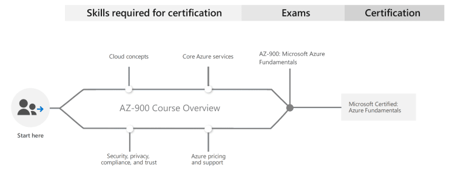

## Module 1

🔷**Describe cloud concepts (15-20%)**

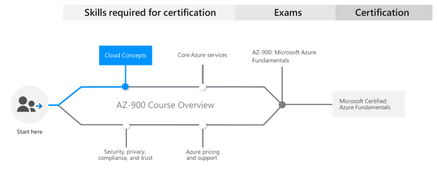

### Cloud Computing, High Availability, Scalability, Elasticity, Agility, Fault Tolerance, and Disaster Recovery

#### Cloud Computing

Service delivery model over the internet (cloud). This includes but is not limited to:

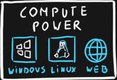

- **Compute Power** meaning servers such as windows, linux, hosting environments, etc.

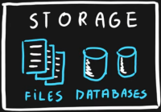

- **Storage** like files and/or databases

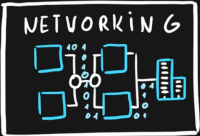

- **Networking** in azure but also outside when connecting to your company network

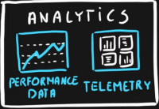

- **Analytics services** for visualization and telemetry data

#### Cloud Key concepts

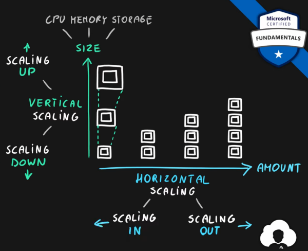

- **Scalability** - the ability to scale, so allocate and deallocate resources at any time

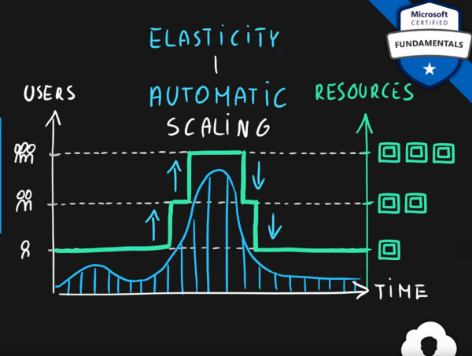

- **Elasticity** - the ability to scale dynamically

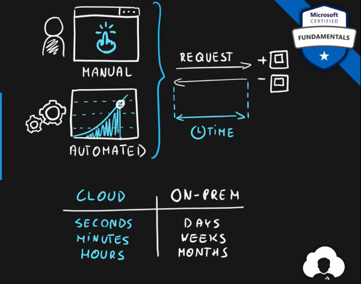

- **Agility** - the ability to react fast (scale quickly)

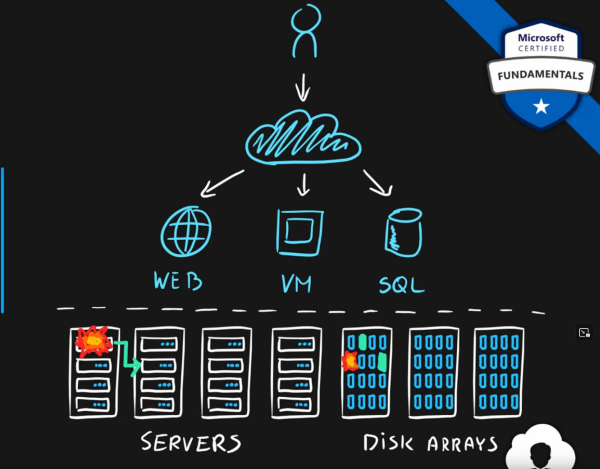

- **Fault Tolerance** - the ability to maintain system uptime while physical and service component failures happen

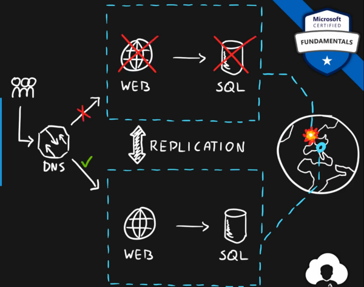

- **Disaster Recovery** - the process and design principle which allows a system to recovers from natural or human induced disasters

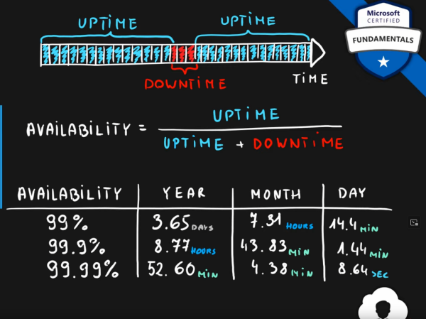

- **High Availability** - the agreed level of operational uptime for the system. It is a simple calculation of system uptime versus whole lifetime of the system.

  - **Availability** = uptime/(uptime + downtime)

##### SUMMARY

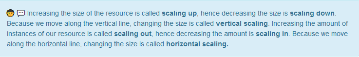

### Principles of economies of scale

#### Economies of Scale

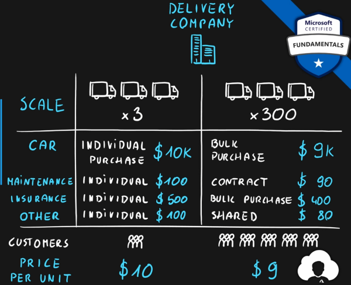

The principle of economies of scale states that as the companies grow they become more effective at managing shared operations. Be that HR and hiring, taxes, accounting, internal operations, marketing, big purchases via contracts meaning better discounts, etc. etc.

Because of those, companies can save/earn more which in return allows for reduction in cost of their services to their customers. This is so called ‘price per unit’.

It’s not possible to go to 0 because in the end some underlying infrastructure needs to run to provide the services. But the larger the scale the more benefits can be passed to customers.

In fact, in the current scale, Microsoft can already offer multiple services for free due to how small a fraction of the cost it is for them.

### Capital Expenditure (CapEx) vs Operational Expenditure (OpEx) and their differences

#### CapEx vs OpEx

Differences between Capital Expenditure and Operational Expenditure

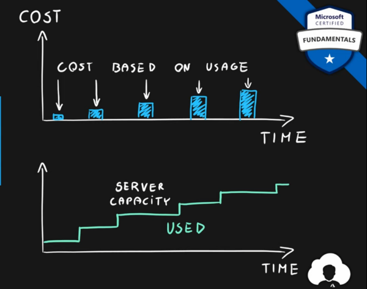

|                   | Capital Expenditure | Operational Expenditure |
| ----------------- | ------------------- | ----------------------- |
| Up front cost     | Significant         | None                    |
| Ongoing cost      | Low                 | Based on usage          |
| Tax Deduction     | Over time           | Same year               |
| Early Termination | No                  | Anytime                 |
| Maintenance       | Significant         | Low                     |
| Value over time   | Lowers              | No change               |

### Consumption-based model

#### What is a consumption-based model?

The consumption-based model is a pricing model used in the cloud so that customers are only charged based on their resource usage.

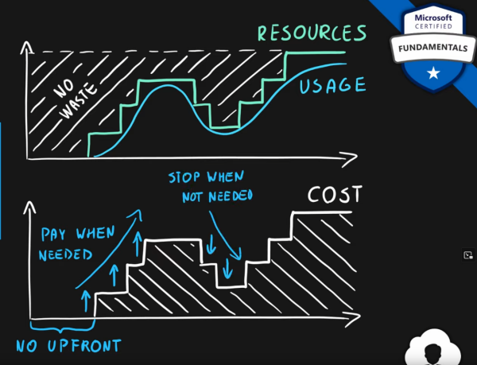

This model is characterized by:

- **No associated upfront cost**
- **No wasted resources** as such no charges are incurred for unused resources\*. Unused in this case is different per service. For instance, blob storage that stores any data is considered to be used, as it consumes the storage space. Virtual Machines that are running consume CPU, memory and other resources even if there isn’t any traffic. Hence they are considered to be used and will incur charges.
- **Pay for what you need**
- **Stop paying when you don’t**

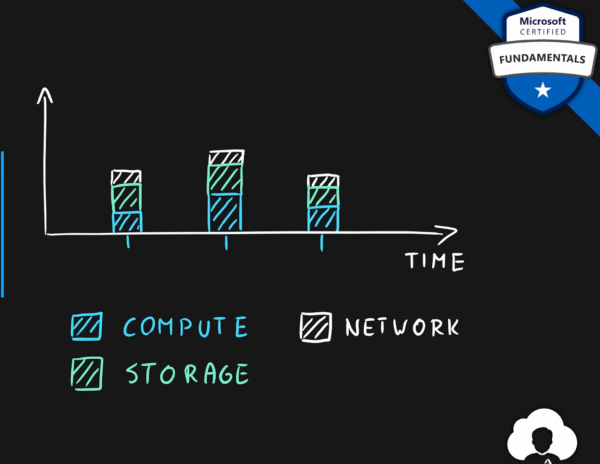

**Consumption** is the virtual metric used to calculate how much each resource (service) in Azure was used. Each service has many smaller metrics that track its consumption to offer best possible pricing model. Those metrics are tracked on very granular level.

### IaaS, PaaS, SaaS and their differences

#### Service Models responsibilities

As a service means which party will manage the particular layer and all the layers below.

- Software layer consists the application (application code and set) & the application data
- Platform layer means all the supporting software and the operating system required to host the application
- Infrastructure layer consists hardware the infrastructure and virtualization required to host the platform

| Layer            | Layer          |
| ---------------- | -------------- |
| Application      | Software       |
| Data             | Software       |
| Runtime          | Platform       |
| Middleware       | Platform       |
| Operating System | Platform       |
| Virtualization   | Infrastructure |
| Servers          | Infrastructure |
| Networking       | Infrastructure |
| Storage          | Infrastructure |

#### Responsibility Matrix

##### On-Premises

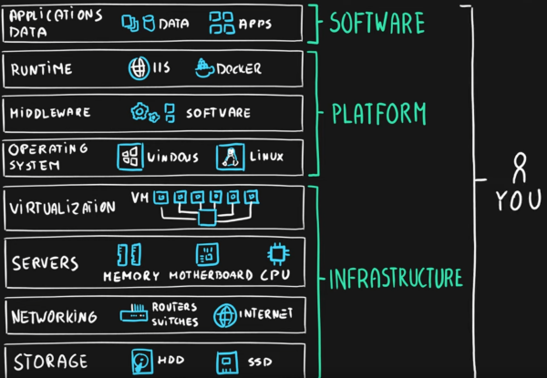

##### IaaS

##### PaaS

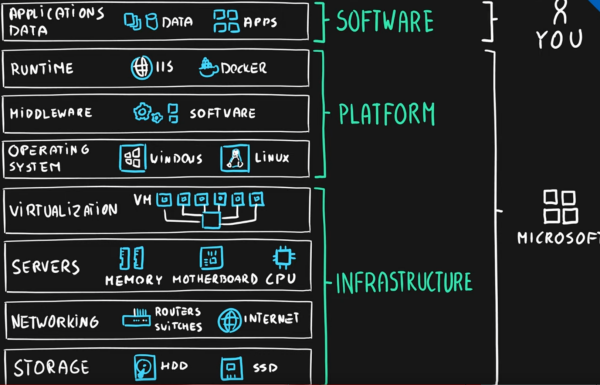

##### SaaS

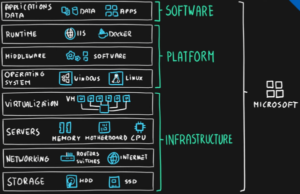

As such following table represents responsibilities
| Layer | On-Premises | IaaS | PaaS | SaaS |
| --- | --- | --- | --- | --- |
| Application | You | You | You | Cloud provider |
| Data | You | You | You | Cloud provider |
| Runtime | You | You | Cloud provider | Cloud provider |
| Middleware | You | You | Cloud provider | Cloud provider |
| Operating System | You | You | Cloud provider | Cloud provider |
| Virtualization | You | Cloud provider | Cloud provider | Cloud provider |
| Servers | You | Cloud provider | Cloud provider | Cloud provider |
| Networking | You | Cloud provider | Cloud provider | Cloud provider |
| Storage | You | Cloud provider | Cloud provider | Cloud provider |

##### Summary

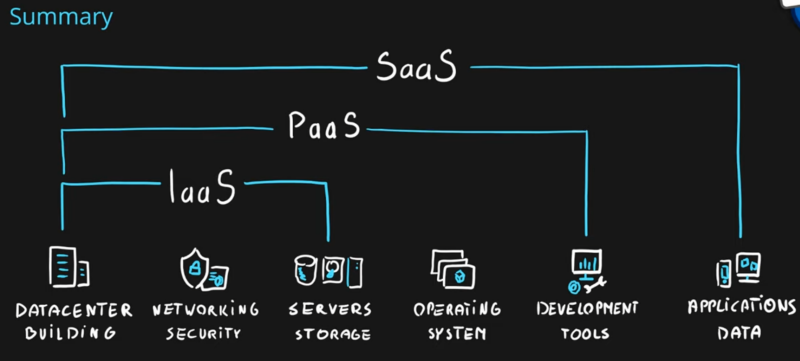

### Episode 6: Public, Private, Hybrid cloud and their differences

#### Cloud Deployment Model

**Cloud Deployment Model** is simple a separation which describes where are the company resources deployed. Whenever this is in public cloud provider environment or private datacenter.

Below table presents high level deployment model separation

| Layer   | Cloud Provider | Own Datacenter |
| ------- | -------------- | -------------- |
| Public  | ✅             | ✖              |
| Hybrid  | ✅             | ✅             |
| Private | ✖              | ✅             |

#### Public Cloud

| Cloud Provider | Own Datacenter |
| -------------- | -------------- |
| ✅             | ✖              |

##### Public Cloud Key Characteristics

Everything runs on cloud provider hardware
No local hardware
Some services share hardware with other customers

##### Public Cloud Advantages

- No CapEx (No initial investment)
- High Availability
- Agility
- Pay as you Go (PAYG) pricing
- No hardware maintenance
- No deep technical skills required

##### Public Cloud Disadvantages

- Not all security and compliance policies can be met
- No ownership over the physical infrastructure
- Rare specific scenarios can’t be done

#### Private Cloud

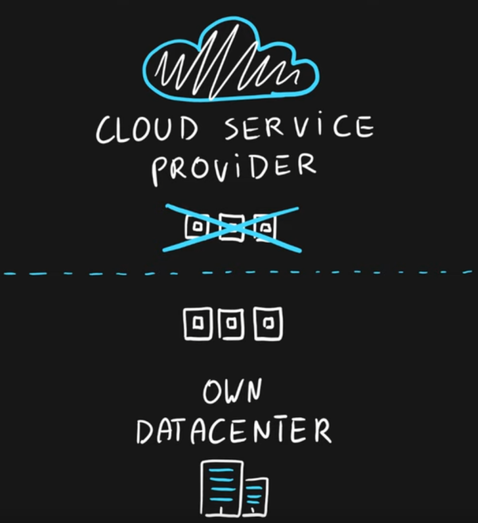

| Cloud Provider | Own Datacenter |
| -------------- | -------------- |
| ✖              | ✅             |

##### Private Cloud Key Characteristics

- Everything runs on your own datacenter
- Self-service should be provided
- You maintain the hardware

##### Private Cloud Advantages

- Can support any scenario
- Total control over security and infrastructure
- Can meet any security and compliance policy

##### Private Cloud Disadvantages

- Initial investment is required (CapEx)
- Limited agility constrained by server capacity and team skills
- Very dependent on IT skills & expertise

#### Hybrid Cloud

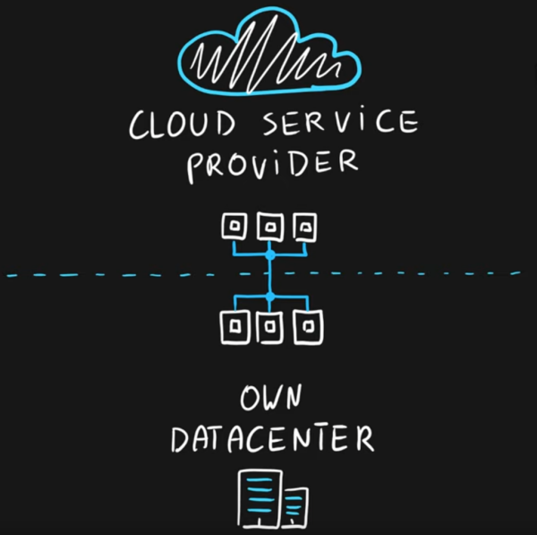

| Cloud Provider | Own Datacenter |
| -------------- | -------------- |
| ✅             | ✅             |

##### Hybrid Cloud Key Characteristic

- Combines both Public & Private cloud

##### Hybrid Cloud Advantages

- Great flexibility
- You can run any legacy apps in private cloud
- Can utilize existing infrastructure
- Meet any security& compliance requirements
- Can take advantage of all public cloud benefits

##### Hybrid Cloud Disadvantages

- Can be more expensive
- Complicated to manage due to larger landscape
- Most dependent on IT skills & expertise from all three models

## Module 2

🔷 Describe core Azure services (30-35%)

Describe the core Azure architectural components

### Episode 7: Azure Regions and Availability Zones

#### Data Center

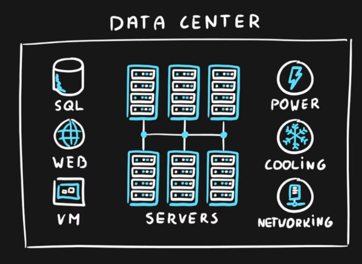

- **Physical facility**
- **Hosting for** group of networked servers
- Own **power, cooling & networking** infrastructure

#### Regions

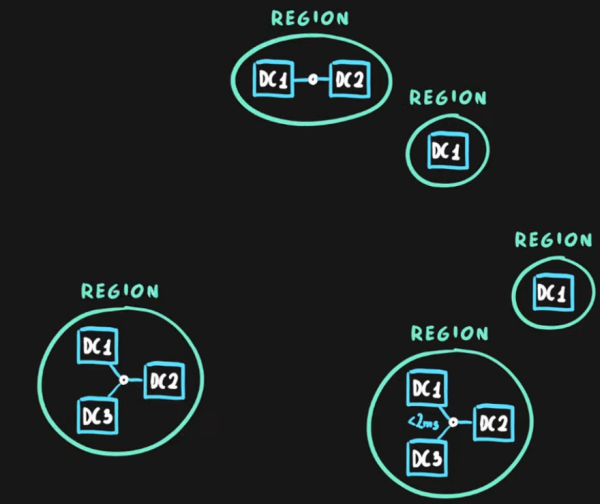

- **Geographical area** on the planet
- **One but usually more datacenters** connected with **low-latency network** (<2 milliseconds)
- **Location** for your services
- Some services are **available only in certain regions**
- Some services are **global services**, as such are not assigned/deployed in specific region
- Globally available with **50+ regions**
- Special **government regions** (US DoD Central, US Gov Virginia, etc.)
- Special **partnered regions** (China East, China North)

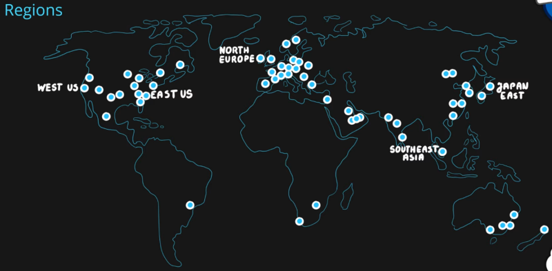

#### Availability Zone

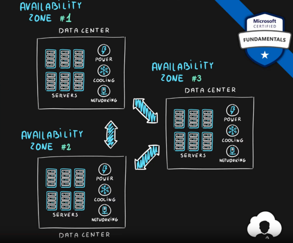

- **Regional feature**
- Grouping of **physically separate** facilities (multiple datacenters)

  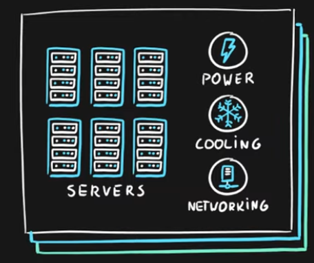

- Designed to **protect from data center failures**
- If zone goes down **others continue working**
- Two service **categories**

  - **Zonal** services (Virtual Machines, Disks, etc.)
  - **Zone-redundant** services (SQL, Storage, etc.)

  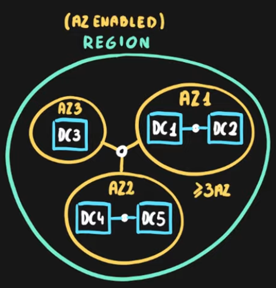

- **Not all** regions are **supported**
- **Supported** region has **three or more zones**
- A **zone** is **one or more data centers**

#### Region Pair

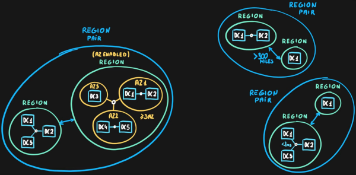

- **Each region** is **paired** with another region making it a region pair
- Region **pairs are static** and cannot be chosen
- Each pair resides within the **same geography**\*
  - Exception is Brazil South
- **Physical isolation** with at least 300 miles distance (when possible)
- Some services have **platform-provided replication**
- **Planned updates** across the pairs
- **Data residency** maintained for disaster recovery

| Region Pair A          | Region Pair B              |
| ---------------------- | -------------------------- |
| East US                | West US                    |
| UK West                | UK South                   |
| North Europe (Ireland) | West Europe (Netherlands)  |
| East Asia (Hong Kong)  | Southeast Asia (Singapore) |

#### Geographies

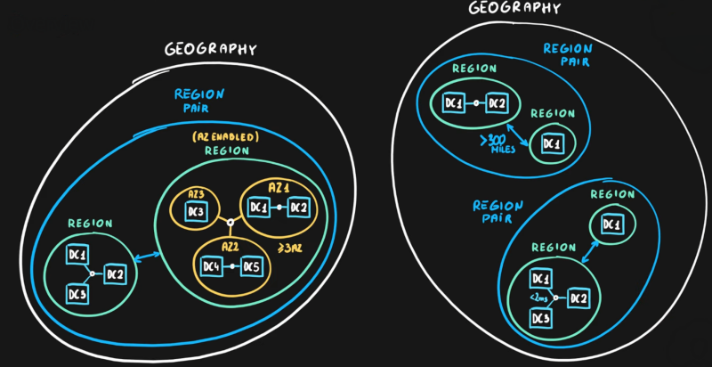

- **Discrete market**
- Typically **contains two or more regions**
- Ensures **data residency, sovereignty, resiliency, and compliance** requirements are met
- **Fault tolerant** to protect from region wide failures
- Broken up into areas
  - **Americas**,
  - **Europe**,
  - **Asia Pacific**,
  - **Middle East** and **Africa**
- Each **region belongs only to one Geography**

### Episode 8: Azure Resource Groups and Resource Manager

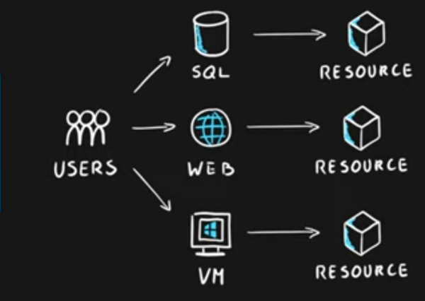

#### Azure Resource

- Object **used to manage services** in Azure
- Represents **service lifecycle**
- Saved as **JSON definition**

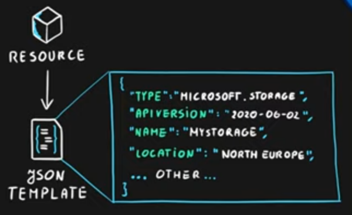

#### Resource Groups

- **Grouping** of resources
- Holds **logically related** resources
- Typically organizing by

  - **Type**

  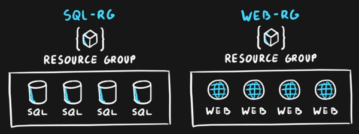

  - **Lifecycle** (app, environment)

  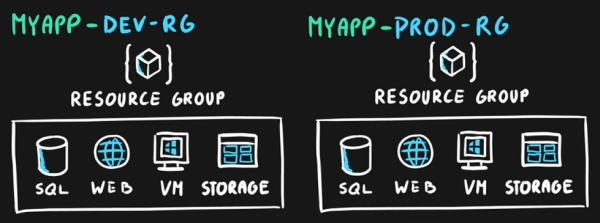

  - **Department**
  - **Billing**,
  - **Location** or
  - **combination** of those

#### Resource Manager

- **Management Layer** for all resources and resource groups
- **Unified** language
- **Controls access** and **resources**

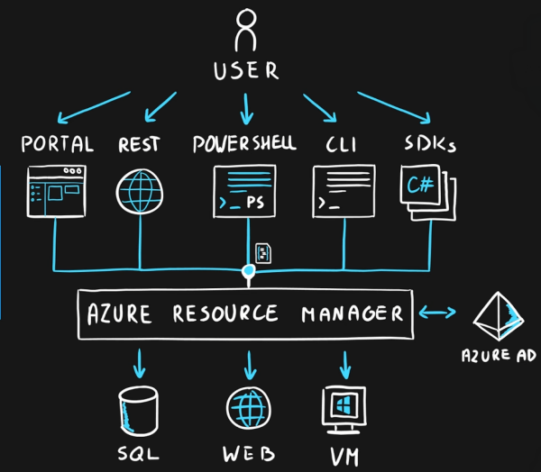

#### Additional Info

- Each **resource must** be in one, and **only one resource group**
- Resource **groups have their own location** assigned
- Resources in the resource groups can **reside in a different locations**
- Resources **can be moved** between the resource groups
- Resource **groups can’t be nested**
- Organize based on your organization needs but consider
  - Billing
  - Security and access management
  - Application Lifecycle

### Episode 9: Azure Compute Services | Virtual Machine, VM Scale Set, App Service, Functions, Container ### Instances, Kubernetes Service

NOTE: [Watch this video first!](https://youtu.be/eyNBf1sqdBQ?si=LYm7f1gbLYLXa1oK)

#### Virtualization

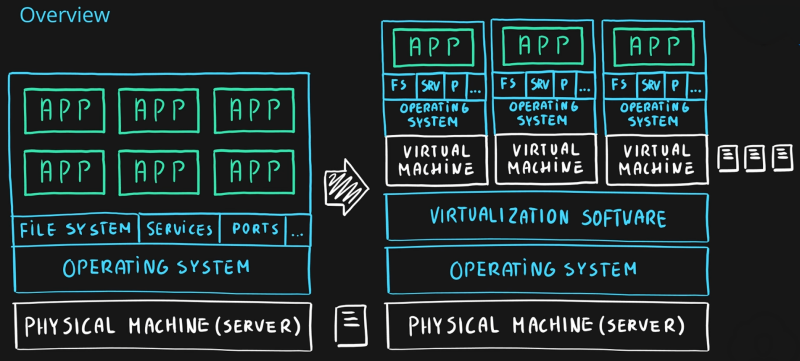

- Emulation of physical machines
- Different virtual hardware configuration per machine/app
- Different operating systems per machine/app
- Total separation of environments
  - file systems,
  - services,
  - ports,
  - middleware,
  - configuration

#### Virtual Machines

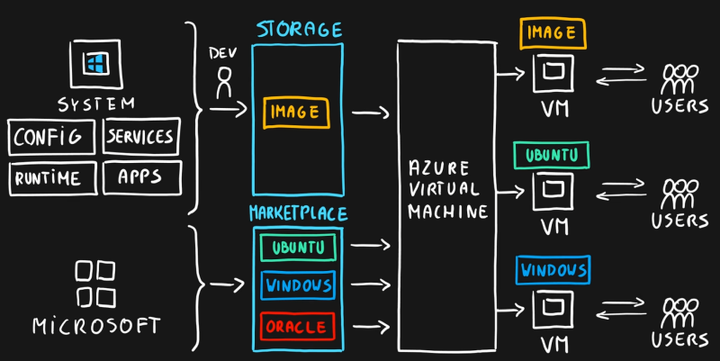

- Infrastructure as a Service (IaaS)
- Total control over the operating system and the software
- Supports marketplace and custom images
- Best suited for
  - Custom software requiring custom system configuration
  - Lift-and-shift scenarios
- Can run any application/scenario
  - web apps & web services,
  - databases,
  - desktop applications,
  - jumpboxes,
  - gateways, etc.

#### Virtual Machine Scale Sets

- Infrastructure as a Service (IaaS)
- Set of identical virtual machines
- Built-in auto scaling features
- Designed for manual and auto-scaled workloads like web services,\* batch processing, etc.

#### Containers

- Use host’s operating system
- Emulate operating system (VMs emulate hardware)
- Lightweight (no O/S)
  - Development Effort
  - Maintenance
  - Compute & storage requirements
- Respond quicker to demand changes
- Designed for almost any scenario

#### Azure Container Instances

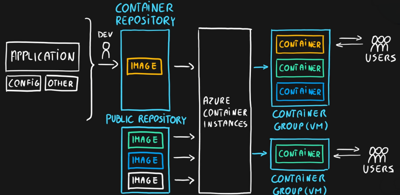

- Simplest and fastest way to run a container in Azure
- Platform as a Service
- Serverless Containers
- Designed for
  - Small and simple web apps/services
  - Background jobs
  - Scheduled scripts

#### Azure Kubernetes Service (AKS)

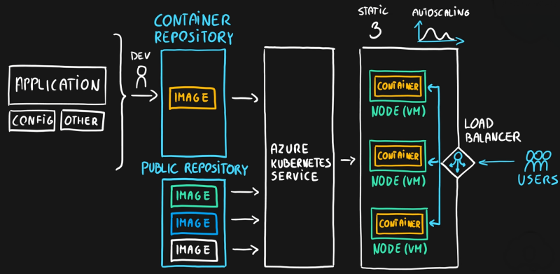

- Open-source container orchestration platform
- Platform as a Service
- Highly scalable and customizable
- Designed for high scale container deployments (anything really!)

#### App Service

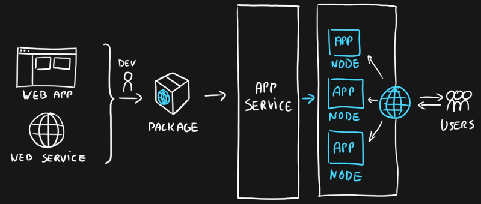

- Designed as enterprise grade web application service
- Platform as a Service
- Supports multiple programming languages and containers

#### Azure Functions (Function Apps)

- Platform as a Service
- Serverless
- Two hosting/pricing models
  - Consumption-based plan
  - Dedicated plan
- Designed for micro/nano-services

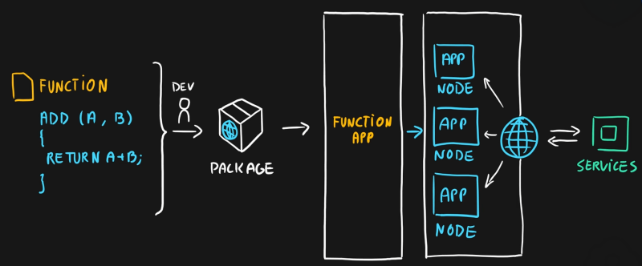

#### Azure Compute Services Summary

- **Virtual Machines (IaaS)** - Custom software, custom requirements, very specialized, high degree of control
- **VM Scale Sets (IaaS)** - Auto-scaled workloads for VMs
- **Container Instances (PaaS)** - Simple container hosting, easy to start
- **Kubernetes Service (PaaS)** - Highly scalable and customizable \* container hosting platform
- **App Services (PaaS)** - Web applications, a lot of enterprise web \* hosting features, easy to start
- **Functions (PaaS) (Function as a Service) (Serverless)** - micro/nano-services, excellent consumption-based pricing, easy to start

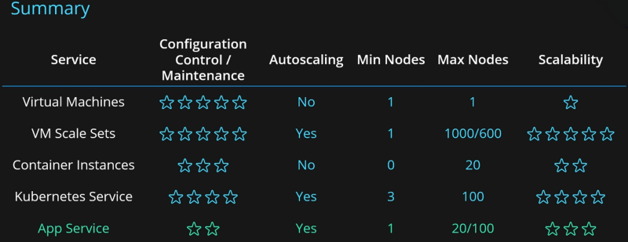

### Episode 10: Azure Networking Services | Virtual Network, Load Balancer, VPN Gateway, Application ## #Gateway, CDN

#### Azure Networking

- Connect cloud and on-premises
- On-premise networking functionality

#### Azure Virtual Network

- Logically isolated networking components
- Segmented into one or more subnets
- Subnets are discrete sections
- Enable communication of resources with each-other, internet and on-premises
- Scoped to a single region
- VNet peering allow cross region communication
- Isolation, Segmentation, Communication, Filtering, Routing

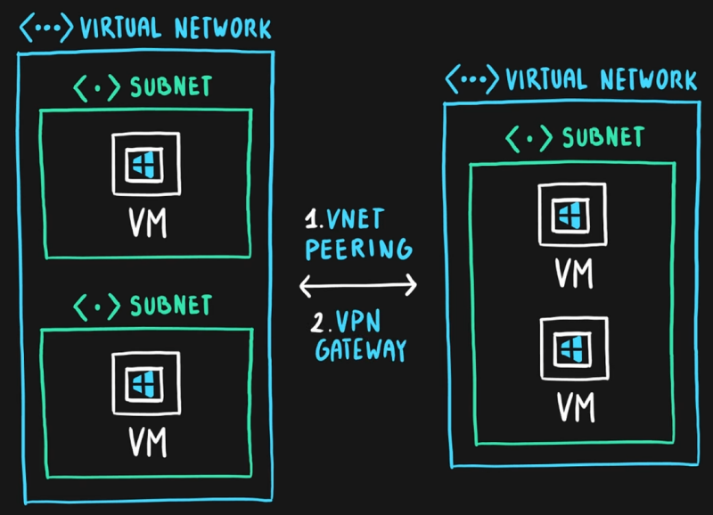

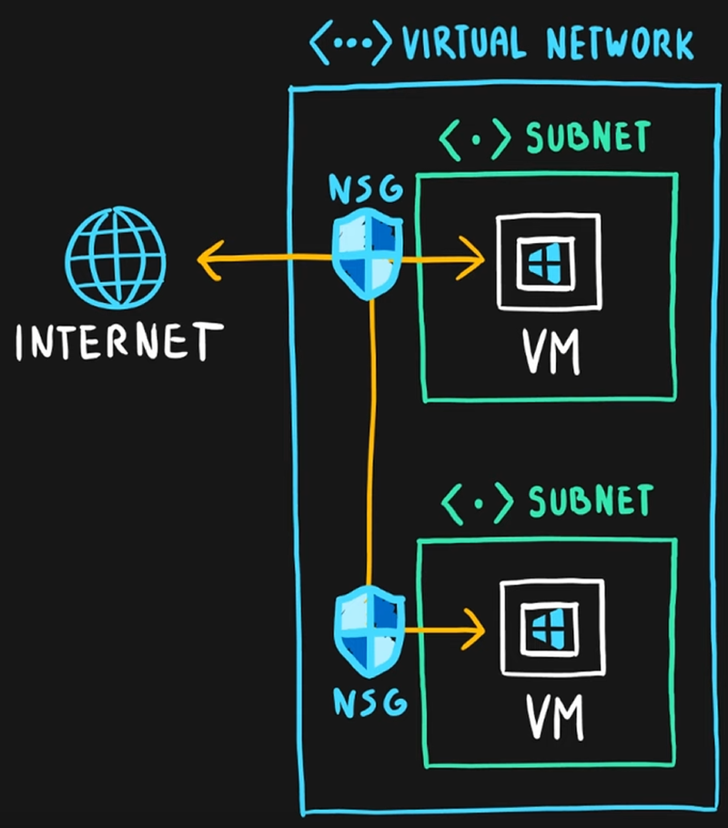

#### Azure Load Balancer

- Even traffic distribution
- Supports both inbound and outbound scenarios
- High-availability scenarios
- Both TCP (transmission control protocol) and UDP (user datagram protocol) applications
- Internal and External traffic
- Port Forwarding
- High scale with up to millions of flows

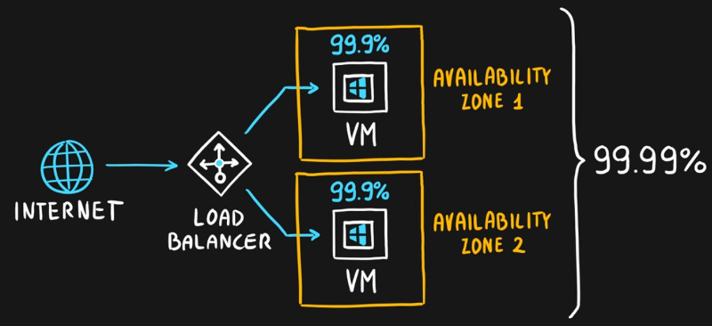

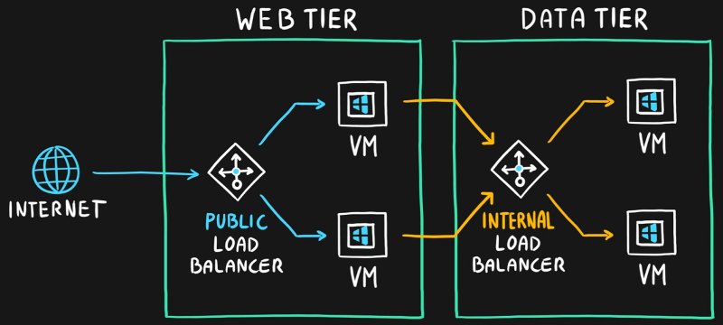

#### VPN Gateway

- Specific type of virtual network gateway for on-premises to azure traffic over the public internet

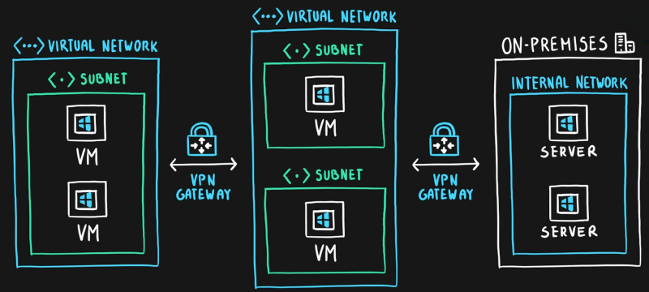

#### Application Gateway

- Web traffic load balancer
- Web application firewall
- Redirection
- Session affinity
- URL Routing
- SSL termination

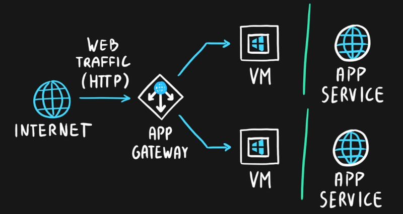

#### Content Delivery Network

- Define content
- Minimize latency
- POP (points of presence) with many locations

#### Networking Summary

- **Azure Virtual Network** - Emulation/representation of physical networking in the cloud, grouping, filtering and segmentation of network related resources
- **Azure VPN Gateway** - Connecting On-Premises with the Vitural Network and Virtual Networks with each other (remember about VNet Peering)
- **Azure Load Balancer** - Even traffic distribution for non-HTTP (non-web) traffic
- **Azure Application Gateway** - Even traffic distribution for HTTP (web) traffic
- **Azure Content Delivery** Network (CDN) - Global content caching & distribution to offload web applications and reduce latency

### Episode 11: Azure Storage Services | Blob, Disk, File and Archive

#### Data Types

- **Structured** - Data that can be represented using tables with very strict schema. Each row must follow defined schema. Some tables have defined relationships between them. Typically used in relational databases.
- **Semi-structured** - Data that can be represented using tables but without strict defined schema. Rows must only have unique key identifier.
- **Unstructured** - Any files in any format. Like binary files, application files, images, movies, etc.

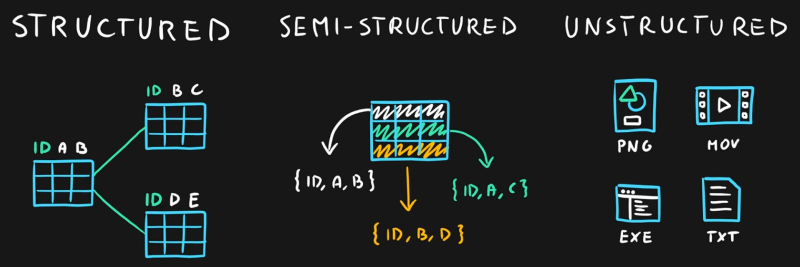

#### Storage Account

- Group of services which include
  - blob storage,
  - queue storage,
  - table storage, and
  - file storage
- Used to store
  - files,
  - messages, and
  - semi-structured data
- Highly scalable (up to petabytes of data)
- Highly durable (99.999999999% - 11 nines, up to 16 nines)
- Cheapest per GB storage

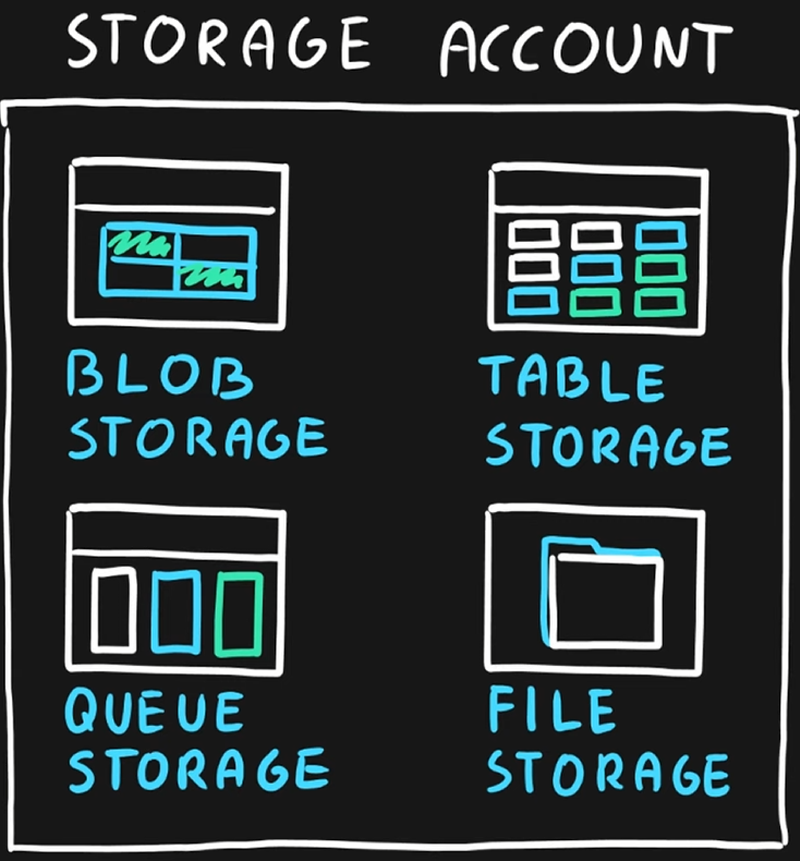

#### Blob Storage

- BLOB – binary large object – file
- Designed for storage of files of any kind
- Three storage tiers
  - Hot – frequently accessed data
  - Cool – infrequently accessed data (lower availability, high durability)
  - Archive – rarely (if-ever) accessed data

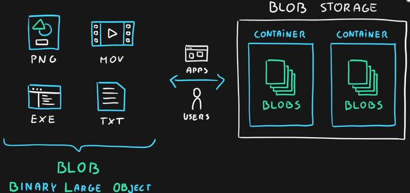

#### Queue Storage

- Storage for small pieces of data (messages)
- Designed for scalable asynchronous processing

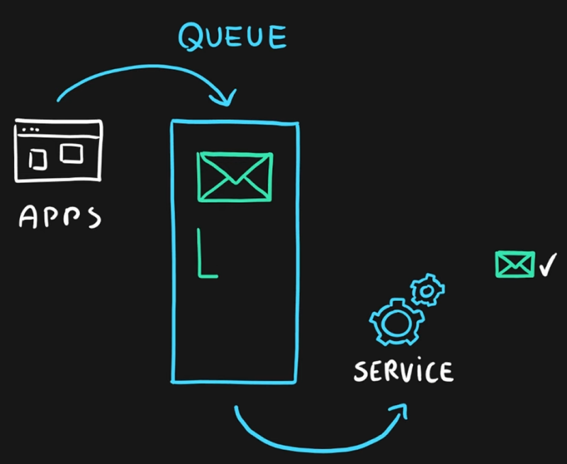

#### Table Storage

- Storage for semi-structured data (NoSQL)
  - No need for foreign joins, foreign keys, relationships or strict schema
  - Designed for fast access
- Many programming interfaces and SDKs

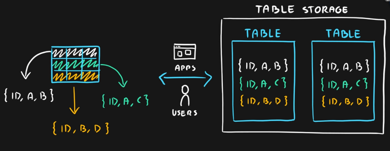

#### File Storage

- Storage for files accessed via shared drive protocols
- Designed to extend on-premise file shares or implement lift-and-shift scenarios
- Similar to BLOB but are files transferred using SMB
  - They are both file storage services but BLOB has TONS and TONS of features for programming applications which need file storage capability whereas File Storage service is very simple and its only purpose is Share Drive connectivity. As such for 95%+ of cases use BLOB.

#### Disk Storage

- Disk emulation in the cloud
- Persistent storage for Virtual Machines
- Different
  - sizes,
  - types (SSD, HDD)
  - performance tiers
- Disk can be unmanaged or managed

### Episode 12: Database Services | Cosmos DB, SQL Database, SQL DB for MySQL and PostgreSQL, SQL Managed ### Instance

#### Data Types - Once more

- **Structured** - Data that can be represented using tables with very strict schema. Each row must follow defined schema. Some tables have defined relationships between them. Typically used in relational databases.
- **Semi-structured** - Data that can be represented using tables but without strict defined schema. Rows must only have unique key identifier.
- **Unstructured** - Any files in any format. Like binary files, application files, images, movies, etc.

#### Cosmos DB

- Globally distributed NoSQL (semi-structured data) Database service
- Schema-less
- Multiple APIs (SQL, MongoDB, Cassandra, Gremlin, Table Storage)
- Designed for

  - Highly responsive (real time) applications with super low latency responses <10ms
  - Multi-regional applications

  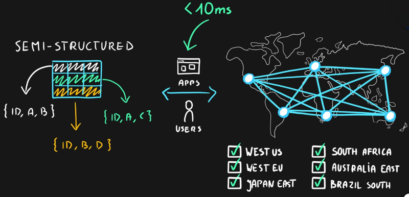

#### Azure SQL Database

- **Relational database** service in the cloud (PaaS) (DBaaS - Database as a Service)
- **Structured data** service defined using schema and relationships
- **Rich Query Capabilities** (SQL)
- **High-performance**, reliable, fully managed and secure database for building - applications

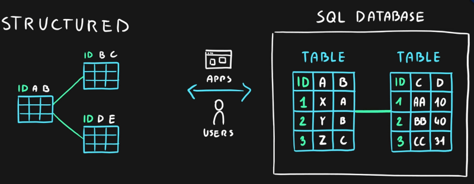

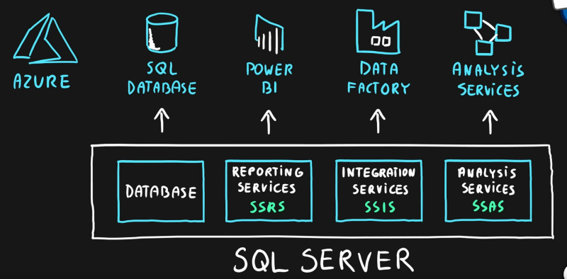

#### Azure SQL product family

- Azure **SQL Database** – Reliable relational database based on SQL Server
- Azure **Database for MySQL** – Azure SQL version for MySQL database engine
- Azure **Database for PostgreSQL** – Azure SQL version for PostgreSQL database engine
- Azure **SQL Managed Instance** – Fully fledged SQL Server managed by cloud provider
- Azure **SQL on VM** – Fully fledged SQL Server on IaaS
- Azure **SQL DW (Synapse)** – Massively Parallel Processing (MPP) version of SQL Server

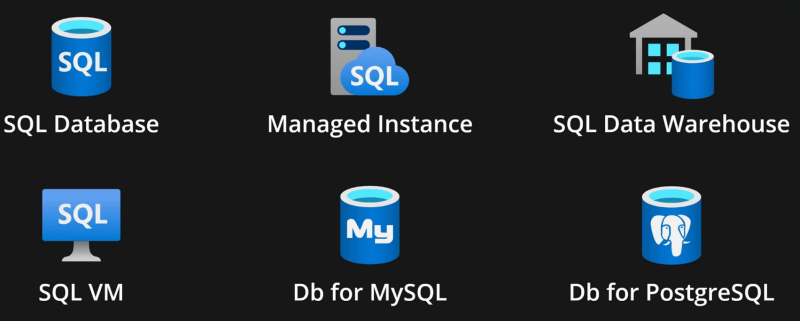

### Episode 13: Azure Marketplace

Describe some of the solutions available on Azure

- Think of it like an “Azure Shop” where you purchase services and solutions for the Azure platform
- Each product is a template which contains one or multiple services
- Products are delivered by first and third-party vendors
- Solutions can leverage all service categories like IaaS, PaaS and SaaS

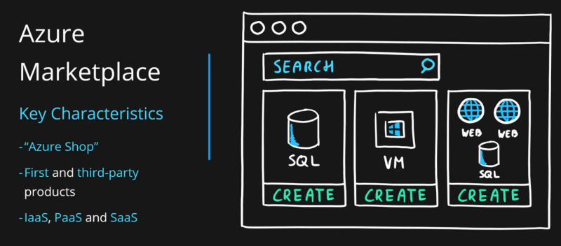

Azure Marketplace is part of a large commercial marketplace

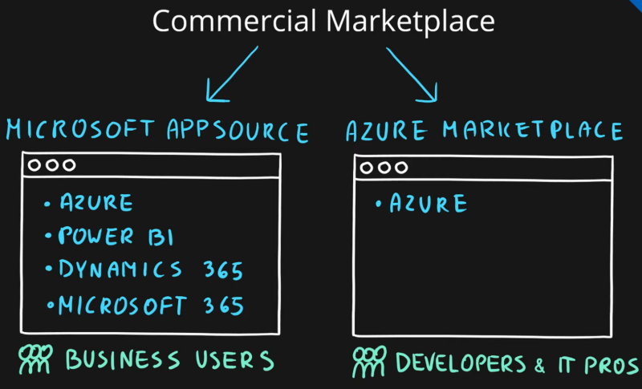

### Episode 14: Azure IoT Services | IoT Hub, IoT Central, Azure Sphere

What is Internet of Things?

Internet of Things (IoT) is a network of internet connected devices (IoT Devices) embedded in everyday objects enabling sending and receiving data such as settings and telemetry.

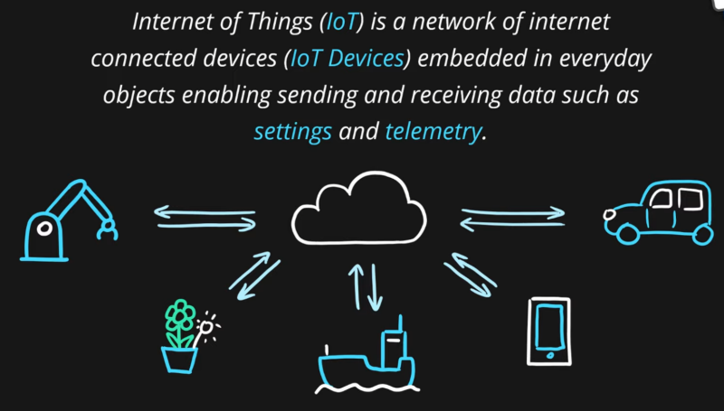

#### Azure Iot Hub

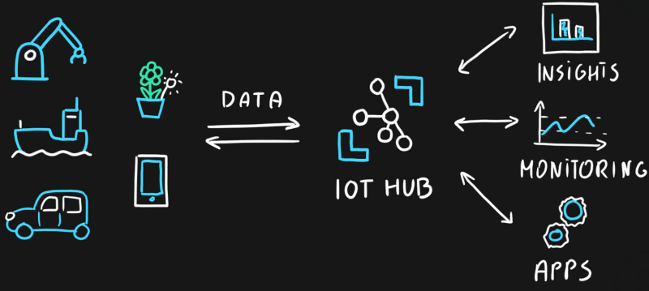

- Managed service for bi-directional communication
- Platform as a Service (PaaS)
- Highly secure, scalable and reliable
- Integrates with a lot of Azure Services
- Programmable SDKs for popular languages (C, C#, Java, Python, Node.js)
- Multiple protocols (HTTPS, AMQP, MQTT)

#### Azure IoT Central

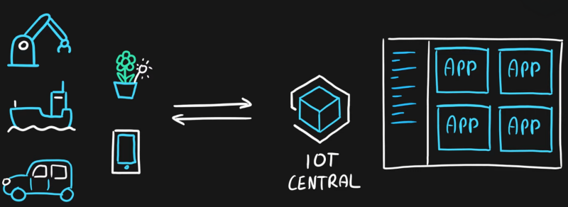

- IoT App Platform - Software as a Service (SaaS)
- Industry specific app templates
- No deep technical knowledge required
- Service for connecting, management and monitoring IoT devices
- Highly secure, scalable and reliable
- Built on top of the IoT Hub service and 30+ other services

#### Azure Sphere

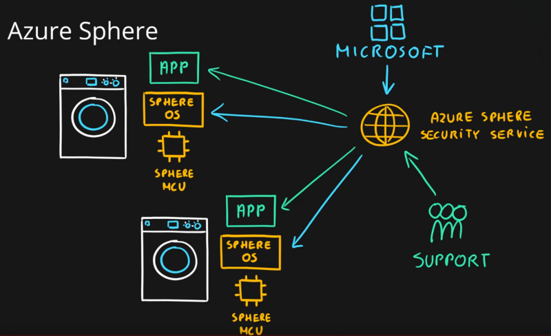

- Secure end-2-end IoT Solutions
  - Azure Sphere certified chips (microcontroller units - MCUs)
  - Azure Sphere OS based on Linux
  - Azure Security Service trusted device-to-cloud communicatio n

### Episode 15: Azure Big Data and Analytics Services | Synapse Analytics (SQL Datawarehouse), HDInsight, ### Databricks

#### What is Big Data?

**Big Data** is a field of technology that helps with the **extraction**, **processing** and **analysis** of information that is too large or complex to be dealt with by traditional software.

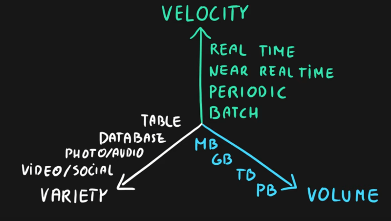

#### The three V’s rule

Big data typically has one of the following characteristics

- **Velocity** - how fast the data is coming in or how fast we are processing it
  - Batch
  - Periodic
  - Near Real Time
  - Real Time
- **Volume** - how much data we are processing
  - Megabytes
  - Gigabyte
  - Terabytes
  - Petabytes
- **Variety** - how structured/complex the data is
  - Tables
  - Databases
  - Photo, Audio
  - Video, Social Media

#### Azure Synapse Analytics

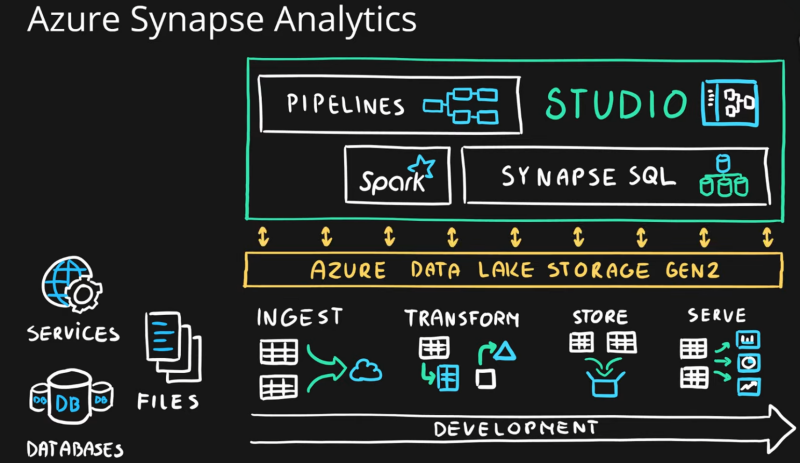

- Big data analytics platform (PaaS)
- Multiple components
  - Spark
  - Synapse SQL
    - SQL pools (dedicated – pay for provisioned performance)
    - SQL on-demand (ad-hoc – pay for TB processed)
  - Synapse Pipelines (Data Factory – ETL)
  - Studio (unified experience)

#### Azure HDInsight

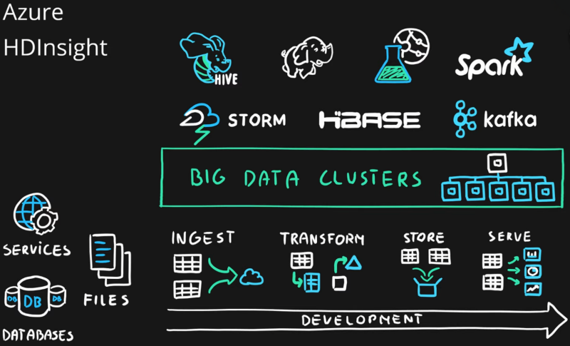

- Flexible multi-purpose big data platform (PaaS)
- Multiple technologies supported (Hadoop, Spark, Kafka, HBase, Hive, Storm, Machine Learning)

#### Azure Databricks

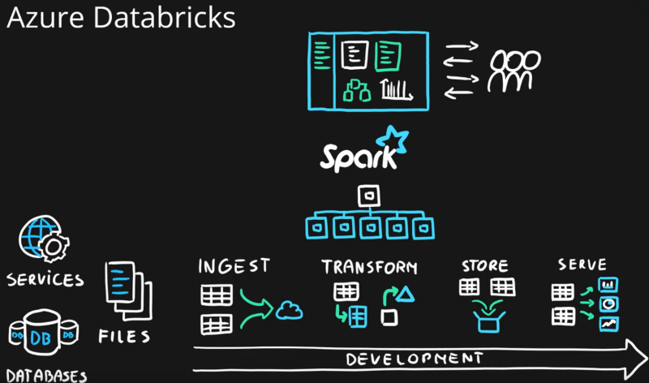

- Big data collaboration platform (PaaS)
- Unified workspace for notebook, cluster, data, access management and collaboration
- Based on Apache Spark
- Integrates very well with common Azure data services

### Episode 16: Azure Artificial Intelligence (AI) Services | Machine Learning Studio and Service

#### What is Artificial Intelligence?

**Artificial Intelligence (AI)** is the simulation of human intelligence & capabilities by computer software.

#### What is Machine Learning?

Machine Learning is a subcategory of AI where a computer software is **“taught”** to **draw conclusions** and **make predictions from data**.

#### Azure Machine Learning

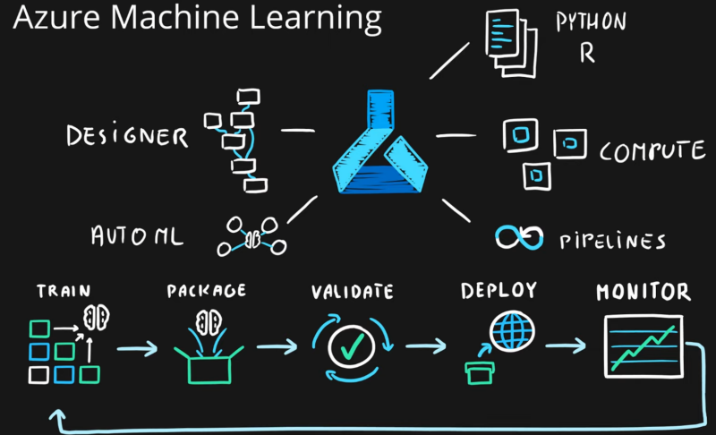

- Cloud-based platform for creating, managing and publishing machine learning models
- Platform as a Service (PaaS)
- Machine Learning Workspace – top level resource
- Machine Learning Studio – web portal for end-2-end development
- Features
  - Notebooks – using Python and R
  - Automated ML – run multiple algorithms/parameters combinations, choose the best model
  - Designer – graphical interface for no-code development
  - Data & Compute – management of storage and compute resources
  - Pipelines – orchestrate model training, deployment and management tasks

### Episode 17: Azure Serverless Computing Services | Functions, Logic Apps, Event Grid

#### What is Serverless?

**Serverless computing** is cloud-hosted execution environment that allows customers to **run their applications** in the cloud **while completely abstracting underlying infrastructure**.

#### Azure Functions

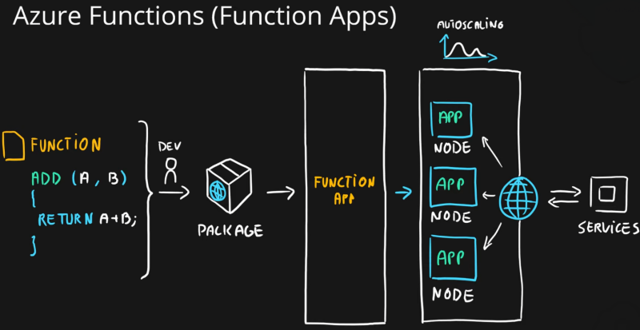

- Serverless coding platform (Functions as a Service, FaaS)
- Designed for nano-service architectures and event-based applications
- Scales up and down very quickly
- Highly scalable
- Supports popular languages and frameworks (.NET & .NET Core, Java, Node.js, Python, PowerShell, etc.)

#### Azure Logic Apps

- Serverless enterprise integration service (PaaS)
- 200+ connectors for popular services
- Designed for orchestration of
  - business processes,
  - integration workflows for applications, data, systems and services
- No-code solution

#### Azure Event Grid

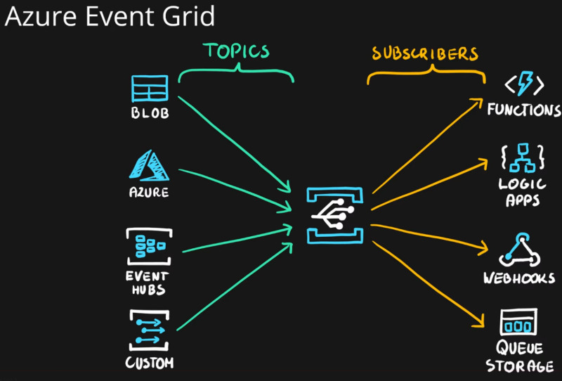

- Fully managed serverless event routing service
- Uses publish-subscribe model
- Designed for event-based and near-real time applications
- Supports dozen of built-in events from most common Azure services

### Episode 18: Azure DevOps Solutions | Azure DevOps, DevTest Labs

#### What is DevOps?

DevOps is a set of practices that combine both development (**Dev**) and operations (**Ops**).

DevOps aims to **shorten the development life cycle** by providing **continuous integration** and **delivery** (CI/CD) capabilities while **ensuring high quality** of deliverables.

#### Azure DevOps

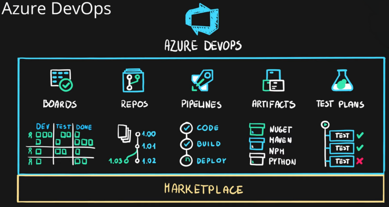

- **Collection of services** for building solutions using DevOps practices
- Services included
  - **Boards** – tracking work
  - **Pipelines** – building CI/CD workflows (build, test and deploy apps)
  - **Repos** – code collaboration and versioning with Git
  - **Test Plans** – manual and exploratory testing
  - **Artifacts** – manage project deliverables
- Extensible with **Marketplace** – over 1000 of available apps
- Evolved from **TFS** (Team Foundation Server), through **VSTS** (Visual Studio Team Services)

#### Azure DevTest Labs

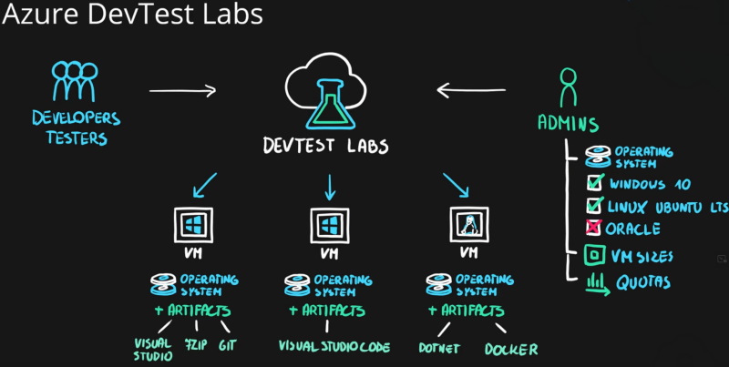

- Service for creation of **sandbox environments** for developers/testers (PaaS)
- Quick setup of **self-managed virtual machines**
- **Preconfigured templates** for VMs
- Plenty of additional **artifacts** (tools, apps, custom actions)
- Lab **policies** (quotas, sizes, auto-shutdowns)
- **Share** and **automate** labs via custom images
- Premade plugins/API/tools for **CI/CD pipeline automation**

### Episode 19: Azure Tools | Portal, PowerShell, CLI and CloudShell

#### Azure Portal

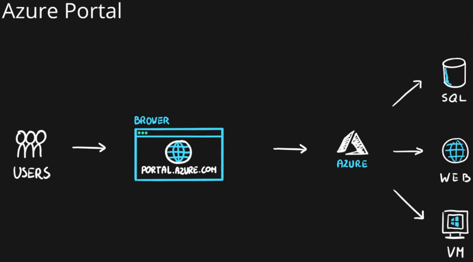

- Public web-based interface for management of Azure platform
- Designed for self-service
- Customizable
- Simple tasks

#### Azure PowerShell

\* [Azure PowerShell Tutorial](https://youtu.be/LbGNQVbb_VI?si=uLEyjHZHuUWuEhum)

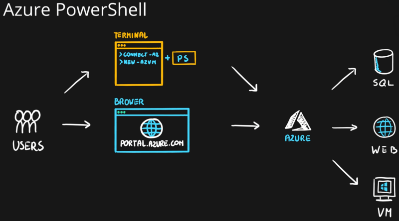

- PowerShell and module
- Designed for automation
- Multi-platform with PowerShell Core
- Simple to use
  - Connect-AzAccount – log into Azure
  - Get-AzResourceGroup – list resource groups
  - New-AzResourceGroup – create new resource group
  - New-AzVm – create virtual machine

#### Azure CLI

\* [Azure CLI Tutorial](https://youtu.be/GqpwiyYsNIw?si=vGQwmYgypg3SoFnf)

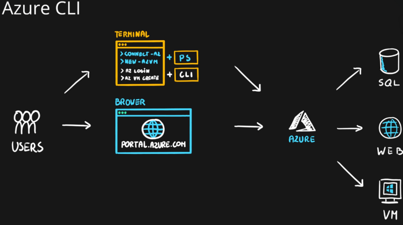

- Command Line Interface for Azure
- Designed for automation
- Multi-platform (Python)
- Simple to use
  - az login – log into Azure
  - az group list – list resource groups
  - az group create – create new resource group
  - az vm create – create virtual machine
- Native OS terminal scripting

#### Azure Cloud Shell

\* [Azure Cloud Shell Tutorial](https://youtu.be/If4g2vVaiYk?si=1HOjHfC4j8hLFoay)

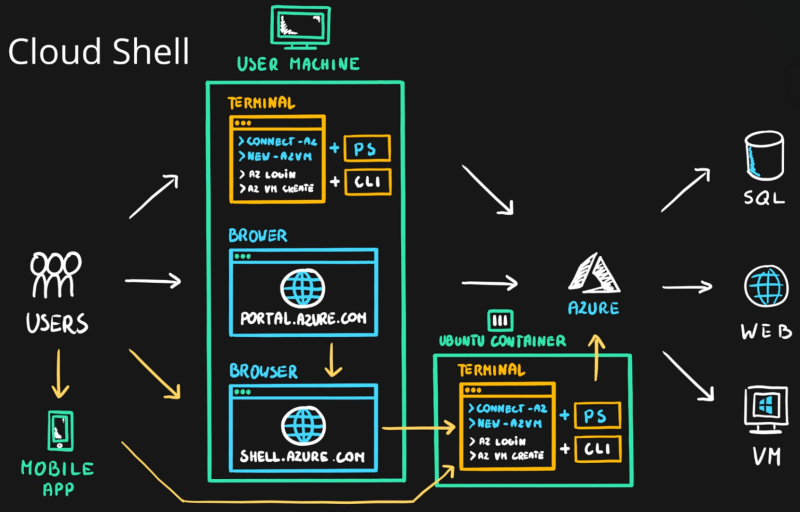

- Cloud-based scripting environment
- Completely free
- Supports both Azure PowerShell and Azure CLI
- Dozen of additional tools
- Multiple client interfaces
  - Azure Portal integration (portal.azure.com)
  - Shell Portal (shell.azure.com)
  - Visual Studio Code Extension
  - Windows Terminal
  - Azure Mobile App
  - Microsoft Docs integration

### Episode 20: Azure Advisor

#### Azure Advisor

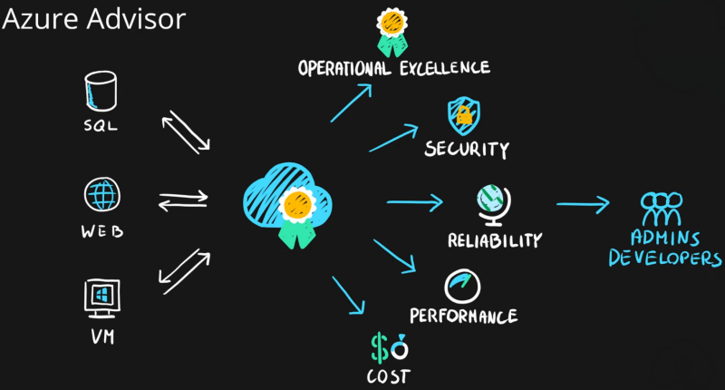

- Personalized consultant service
- Designed to provide recommendations and best practices for
  - Cost (SKU sizes, idle services, reserved instances, etc.)
  - Security (MFA settings, vulnerability settings, agent installations, etc.)
  - Reliability (redundancy settings, soft delete on blobs, etc.)
  - Performance (SKU sizes, SDK versions, IO throttling, etc.)
  - Operational Excellence (service health, subscription limits, etc.)
- Actionable recommendations
- Free!

## Module 3

🔷 Describe Security, Privacy, Compliance, and Trust (25-30%)

Describe securing network connectivity in Azure

### Episode 21: Security Groups | NSG and ASG | Network Security Groups and Application Security grouyps

#### Network Security Groups

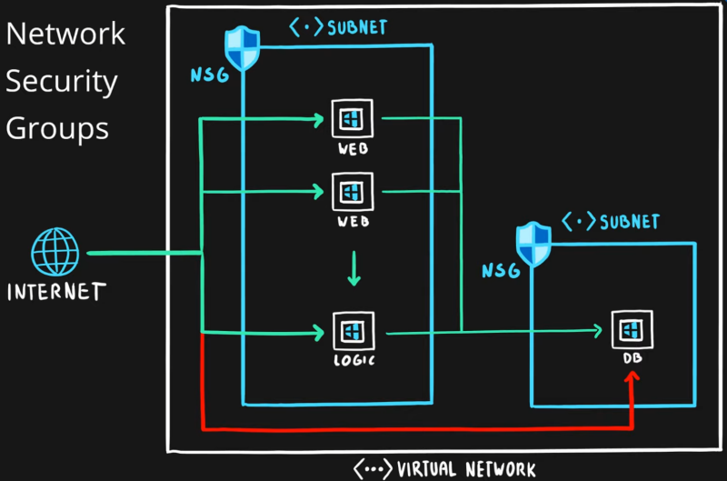

- Designed to filter traffic to (inbound) and from (outbound) Azure resources located in - - Azure Virtual Network
- Filtering controlled by rules
- Ability to have multiple inbound and outbound rules
- Rules are created by specifying
  - Source/Destination (IP addresses, service tags, application security groups)
  - Protocol (TCP, UDP, any)
  - Port (or Port Ranges, ex. 3389 – RDP, 22 – SSH, 80 HTTP, 443 HTTPS)
  - Direction (inbound or outbound)
  - Priority (order of evaluation)

#### Application Security Groups

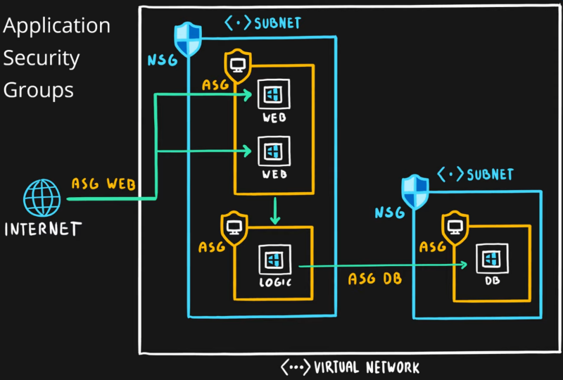

- Feature that allows grouping of virtual machines located in Azure virtual network
- Designed to reduce the maintenance effort (assign ASG instead of the explicit IP address)

### Episode 22: User-defined Routes (UDR)

#### Routing

- Process of finding/selecting a path for traffic in one or across multiple networks.

#### User-defined Routes

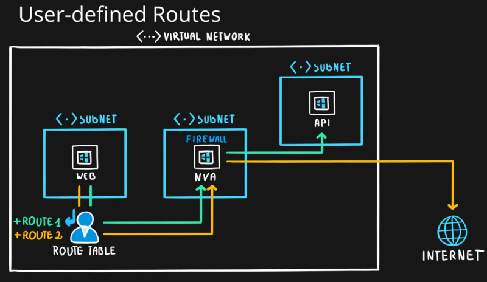

- Custom (user-defined, static) routes (UDRs)
- Designed to override Azure’s default routing or add new routes
- Managed via Azure Route Table resource
- Associated with a zero or more Virtual Network subnets

### Episode 23: Azure Firewall

#### Firewall

- Firewall is a network security service that monitors and controls incoming and outgoing traffic.

#### Azure Firewall

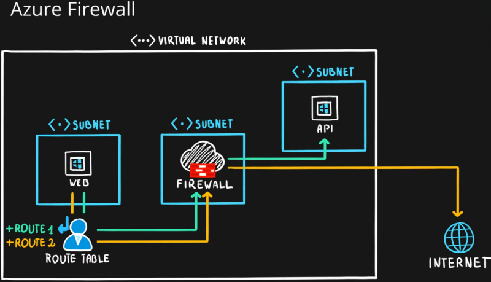

- Managed, cloud-based **firewall service** (PaaS, Firewall as a Service)
- Built-in **high availability**
- Highly **Scalable**
- **Inbound** & **outbound** traffic filtering rules
- Support for **FQDN** (Fully Qualified Domain Name), ex. microsoft.com
- Fully integrated with Azure monitor for logging and analytics

### Episode 24: Azure DDoS Protection

#### DoS - Denial of Service

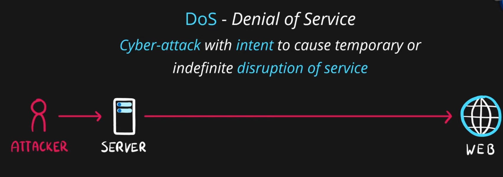

- Cyber-attack with intent to cause temporary or indefinite **disruption of service**

#### DDoS - Distributed Denial of Service

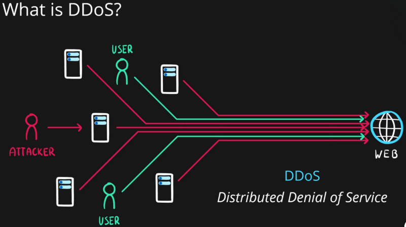

- **DoS** attack that is originating from **multiple servers**

#### Azure DDoS Protection

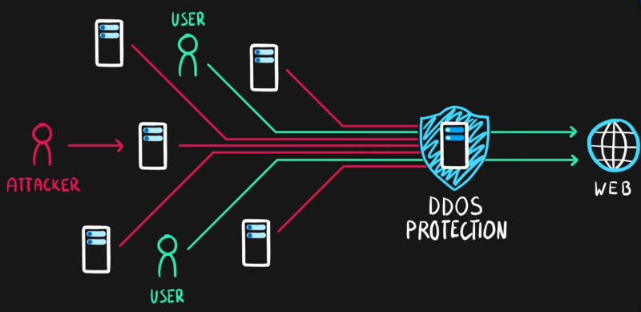

- **DDoS protection service** in Azure
- Designed to
  - **Detect malicious traffic and block it** while allowing legitimate users to connect
  - **Prevent additional costs** for auto-scaling environments
- Two tiers
  - **Basic** – automatically enabled for Azure platform
  - **Standard** – additional mitigation & monitoring capabilities for Azure Virtual Network resources
- Standard tier uses machine learning to **analyze traffic patterns** for better accuracy

### Episode 25: Azure Identity Services | Identity, Authentication, Authorization & Azure AD

Azure Active Directory is now called "Entra ID"

#### Identity

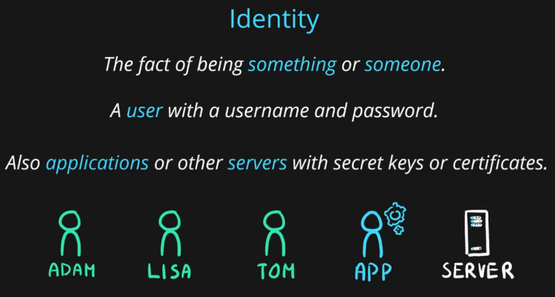

- A user with a username and password.
- Also applications or other servers with secret keys or certificates.
- The fact of being something or someone.

#### Authentication

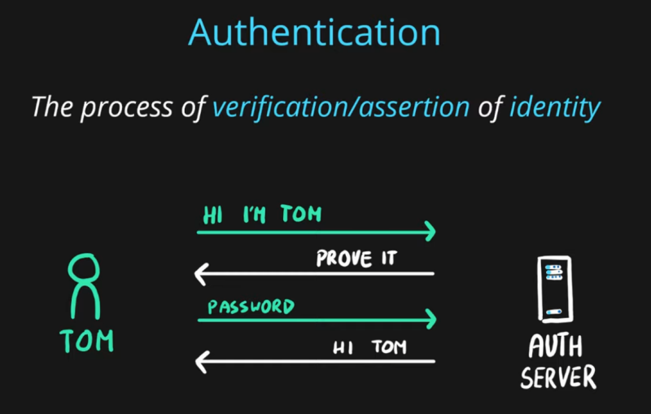

The process of **verification/assertion of identity**

#### Authorization

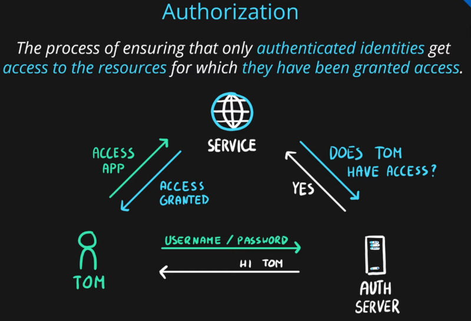

The process of ensuring that only authenticated identities get access to the resources for which they have been granted access.

#### Access Management

The process of controlling, verifying, tracking and managing access to authorized users and applications.

#### Azure Active Directory \*Now called Entra ID

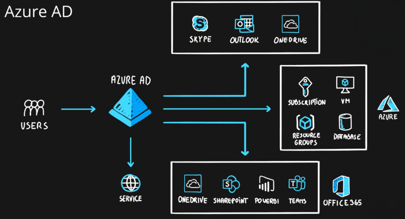

- Identity and Access Management service in Azure
- Identities management – users, groups, applications
- Access management – subscriptions, resource groups, roles, role assignments, authentication & authorization settings, etc.
- Used by multiple Microsoft cloud platforms
  - Azure
  - Microsoft 365
  - Office 365
  - Live.com services (Skype, OneDrive, etc.)

#### Multi-factor Authentication (MFA)

- Process of authentication using more than one factor (evidence) to prove identity
- Factor types
  - Knowledge Factor – “Something you know”, ex. password, pin
  - Possession Factor – “Something you have”, ex. phone, token, card, key
  - Physical Characteristic Factor – “Something you are”, ex. fingerprint, voice, face, eye iris
  - Location Factor – “Somewhere you are”, ex. GPS location
- Supported by Azure AD by default (simple on-off switch)

### Episode 26: Azure Security Center and usage scenarios

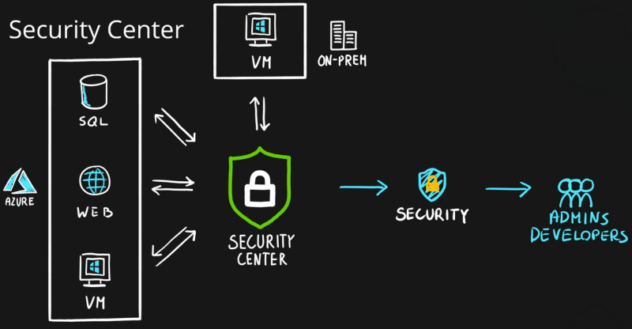

#### Azure Identity

- **Centralized/unified** infrastructure and platform **security management service**
- **Natively embedded** in Azure services
- **Integrated** with **Azure Advisor**
- Two tiers
  - **Free** (Azure Defender OFF) – included in all Azure services, provides continuous assessments, security score, and actionable security recommendations
  - **Paid** (Azure Defender ON) – hybrid security, threat protection alerts, vulnerability scanning, just in time (JIT) VM access, etc.

### Episode 27: Key Vault

#### Azure Key Vault

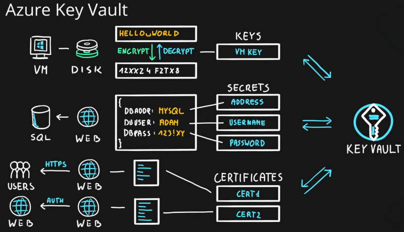

- **Managed service** for **securing sensitive information** (application/platform) (PaaS)
- Secure storage service for
  - **Keys**,
  - **Secrets** and
  - **Certificates**
- **Highly integrated** with other Azure services (VMs, Logic Apps, Data Factory, Web Apps, etc.)
- **Centralization**
- Access **monitoring** and **logging**

### Episode 28: Role-Based Access Control (RBAC)

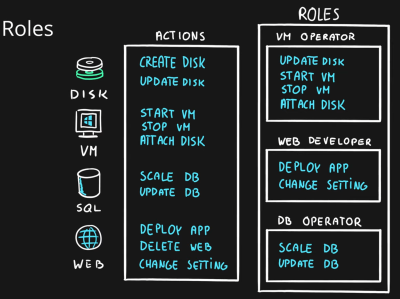

#### What is a Role?

**Role** (role definition) is a **collection of actions** that **the assigned identity** will be able to perform.

Role definition is an answer to a question “**What** can be done?”

#### What is a Security Principal?

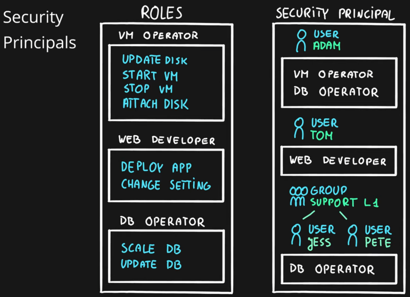

**Security Principal** is an Azure object (identity) that can be assigned to a role (ex. users, groups or applications).

**Security Principal assignment** is an answer to a question “**Who** can do it?”

#### What is a Scope?

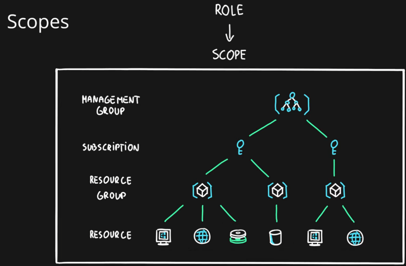

**Scope** is one or more Azure resources that the access applies to.

**Scope assignment** is an answer to a question “**Where** can it be done?”

#### What is a Role Assignment?

**Role assignment** is a combination of the **role definition**, **security principal** and **scope**.

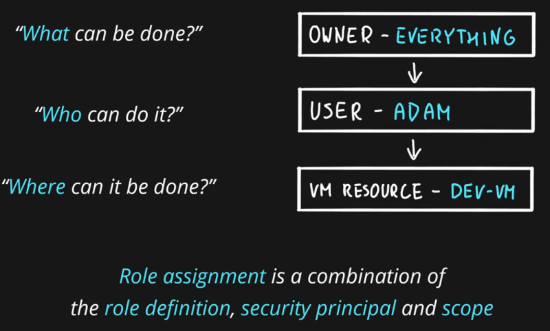

#### Azure Role-based Access Control (RBAC)

- Authorization system built on Azure Resource Manager (ARM)
- Designed for fine-grained access management of Azure Resources
- Role assignment is combination of
  - Role definition – list of permissions like create VM, delete SQL, assign permissions, etc.
  - Security Principal – user, group, service principal and managed identity and
  - Scope – resource, resource groups, subscription, management group
- Hierarchical
  - Management Groups > Subscriptions > Resource Groups > Resources
- Built-in and Custom roles are supported

### Episode 29: Resource Locks

#### What is an Azure Resource Lock?

- Designed to **prevent accidental deletion** and/or **modification**
- Used in conjunction with RBAC
- Two types of locks
  - **Read-only** (**ReadOnly**) – only read actions are allowed
  - **Delete** (**CanNotDelete**) – all actions except delete are allowed
- Scopes are **hierarchical** (**inherited**)
  - Subscriptions > Resource Groups > Resources
- **Management Groups** can’t be locked
- Only **Owner** and **User Access Administrator** roles can manage locks (**built-in** roles)

\*Resource Lock - Individual Resource

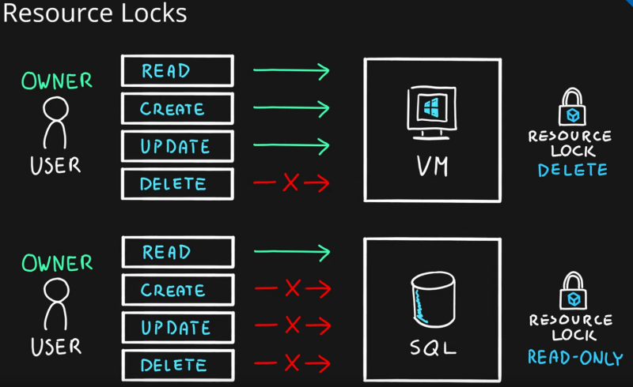

\*Resource Lock - Resource Group

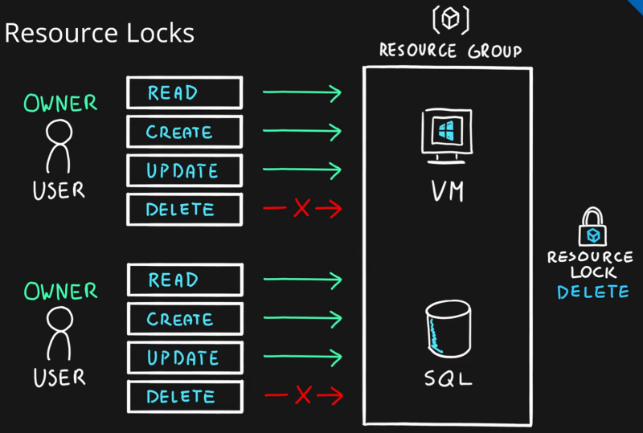

\*Resource Lock - Resource Level

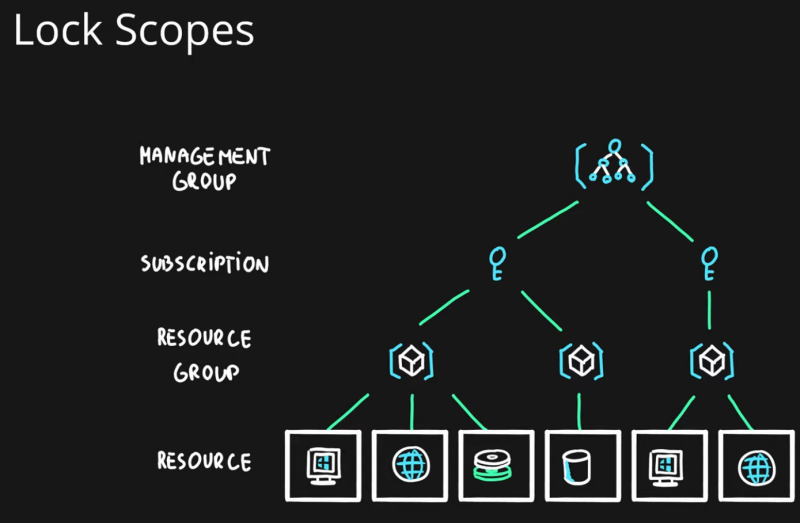

### Episode 30: Tags

#### Azure Resource Tags

- Tags are simple **Name** (key) - **Value pairs**
- Designed to help with **organization of Azure resources**
- Used for resource **governance**, **security**, **operations management**, **cost management**, **automation**, etc.
- Typical **tagging strategies**
  - **Functional** – mark by **function** ( ex: environment = production )
  - **Classification** – mark by **policies used** ( ex: classification = restricted )
  - **Finance/Accounting** – mark for **billing purposes** ( ex: department = finance )
  - **Partnership** – mark by **association of users/groups** ( ex: owner = adam )
- Applicable for **resources**, **resource groups** and **subscriptions**
- **NOT inherited** by default

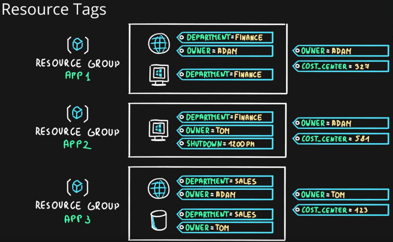

### Episode 31: Azure Policy

#### Azure Policy

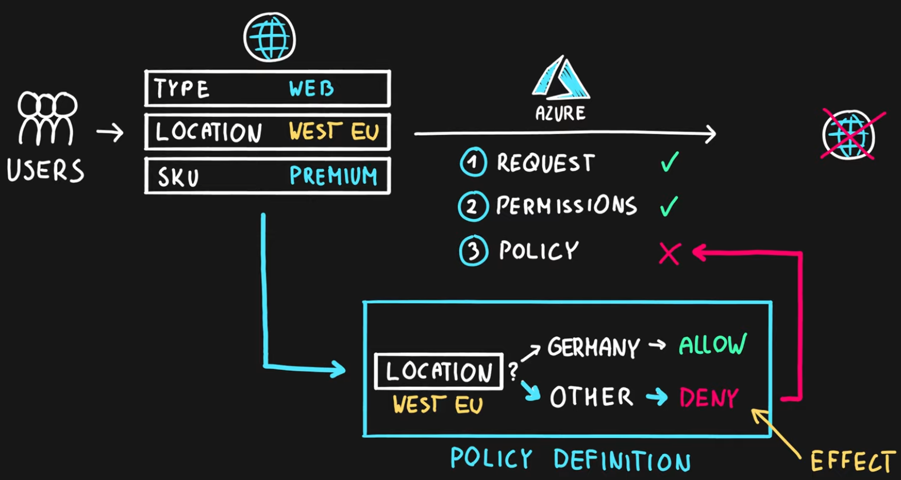

- Designed to help with resource **governance**, **security**, **compliance**, **cost management**, etc.
- **Policies** focus on **resource properties** (**RBAC** focused on **user actions**)
- Policy **definition** – Defines what should happen
  - Define the **condition** (if/else) and the **effect** (deny, audit, append, modify, etc.)
  - Examples include allowed resource types, allowed locations, allowed SKUs, inherit resource tags
- **Built-in** and **custom** policies are supported
- Policy **initiative** – a **group** of policy definitions
- Policy **assignment** – assignment of a policy definition/initiative to a scope
  - Scopes can be assigned to
    - management groups,
    - subscriptions,
    - resource groups, and
    - resources
- Policies allow for **exclusions of scopes**
- Checked during **resource creation** or **updates** and **existing ones with remediation tasks**

### Episode 32: Azure Blueprints

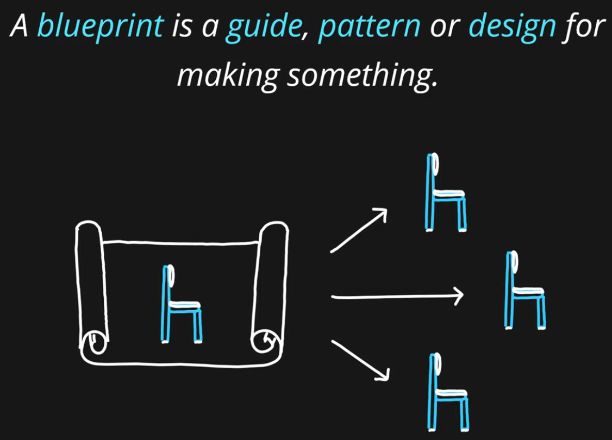

#### Azure Blueprints

- **Package** of various Azure components (**artifacts**)
  - **Resource Groups**
  - **ARM Templates**
  - **Policy Assignments**
  - **Role Assignments**
- **Centralized storage** for organizationally **approved design patterns**
- Blueprint **definition** – describing what should happen (reusable package)
- Blueprint **assignment** – describing where it should happen (package deployment)

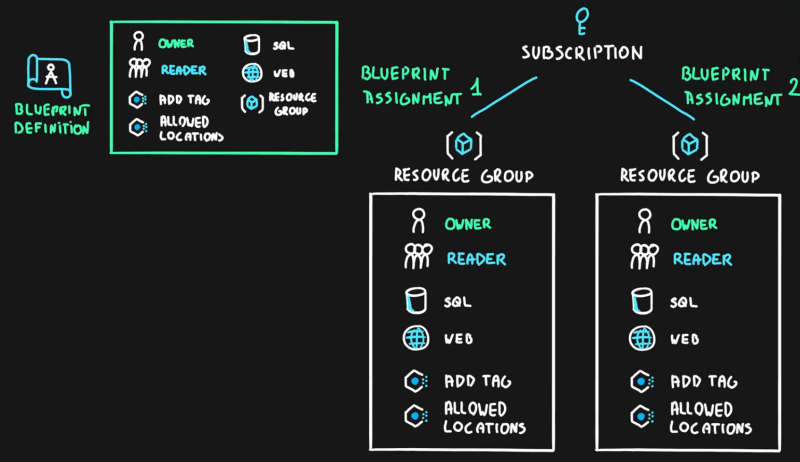

### Episode 33: Cloud Adoption Framework

#### Cloud adoption

**Cloud adoption** is a strategic move by an organization to leverage cloud in their business

#### Cloud Adoption Framework

Cloud Adoption Framework for Azure is a set of

- **tools**,
- **best practices**,
- **guidelines** and
- **documentation**

prepared by Microsoft to help companies with their cloud adoption journey.

#### Strategy

1. Understand your motivation
   - Answer the question **WHY MOVE**?
   - Common Motivation Triggers include
     - **Migration**
       - Cost Savings on infrastructure
       - Reduction in complexity
       - Operation optimization
       - Increased business agility
     - **Innovation**
       - Reaching a global scale
       - Customer experience improvements
       - Transformation of products or services
       - Market disruption
2. Business Outcome
   - Answer the question **WHAT TO MEASURE**?
   - Defined, concise and observable outcome captured by a specific measure, for example
     - Increase in revenue
     - Increase in profit
     - Cost reduction
     - Global access to customers
     - Reaching new markets
3. Business Justification
   - Answer the question **WHAT’S MY RETURN ON INVESTMENT**?
   - Develop a business case to validate the financial model that supports your motivations and outcomes
   - Tools that support this process are
     - Azure TCO (Total Cost of Ownership) calculator - estimate current on-prem costs
     - Azure Pricing Calculator - estimate future Azure costs
     - Azure Cost Management - see current Azure costs
4. First Project
   - Choose first project to validate your strategy (Proof of concept - POC) based on
     - Business Criteria
       - Currently operating
       - Dedicated owner
       - Strong motivation to move
     - Technical Criteria
       - Minimum dependencies and assets

#### Plan

1. Digital Estate (INVENTORY OF ASSETS)
   - Review current landscape and list all projects/solutions (digital assets)
   - Choose one of the five (5) R’s of rationalization:
     - **Rehost** - move as is; typically into containers or IaaS (virtual machines)
     - **Refactor** - make small code changes and move to PaaS (ex. Azure SQL, Azure App Service, etc.)
     - **Rearchitect** - make complex code changes to introduce new features or fix incompatible apps
     - **Rebuild** - create a new application using cloud first design
     - **Replace** - review available SaaS solutions and replace legacy or unneeded applications
2. Initial Organization Alignment
   - Align people so they will support your adoption plan
   - Map people to capabilities
3. Skills Readiness Plan
   - Review current skills and address the gaps
4. Cloud Adoption Plan - combine everything from steps 1 to 3 into a single cloud adoption plan

#### Ready

1. Azure Setup Guide - Review the Azure setup guide to become familiar with the tools and approaches you need to use to create a landing zone.
2. Azure Landing Zone - Choose an appropriate Azure Subscription type that best suits your needs and establish an initial Azure environment.
3. Extend Landing Zone - Expand the initial landing zone to fit your business needs.
4. Best Practices - Review everything and ensure best practices are followed.

#### Adopt

##### Migrate

1. First Migration - migrate your first application to familiarize yourself with the cloud, guidelines and tools
2. Migration Scenarios - review and prepare migration scenarios/guidelines for your company
   - Virtual Machines - Linux, Windows, etc.
   - Apps - Java, .NET, NodeJS web apps, etc.
   - Data - SQL Server, PostreSQL, File Servers, etc.
   - Other - VMware, Azure Stack, etc.
     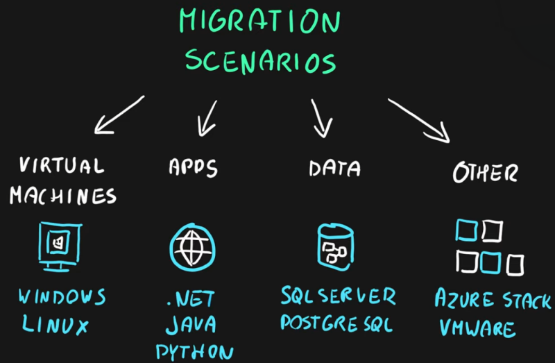
3. Best Practices - address common migration needs through the application of consistent best practices.
4. Process Improvements - important part of this porcess heavy activity is to identify bottlenecks and improve with every migration

##### Innovate

1. Business Value Consensus (VALUE TO STRATEGY)
   1. Create hypothetical customer need
   2. Decide on solution that solves it
   3. Map this to your strategy
2. Innovation Guide (TOOLS) - choose available Azure tools that will help your build this application
3. Best Practices - verify that best practices are followed for all tools in the toolchain
4. Process Improvements - gather feedback from the users and the customers to improve architectural decisions and future products

#### Govern & Manage

1. Define governance solutions - Choose solutions to maintain compliance, security and ensure total control of the environment.

   - Those solutions should focus to
     - Address Business Needs
     - Provide Agility
     - Control Risks

2. Manage cloud environment (CLOUD OPERATIONS) - Hand over solutions and environment to cloud operations team for maintenance. Team should ensure that stability and costs are always in perfect balance to meet business commitments. Team should allow environment to grow, evolve and adapt to changing business needs.

#### Organize

Ensure that everyone knows what to do and when to do it for every stage in this process. One of the ways to achieve this is via RACI (Responsible, Accountable, Consulted, and Informed) matrix.

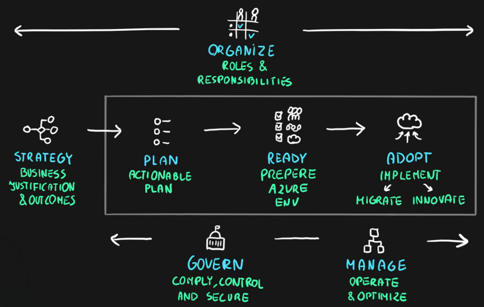

### Episode 34: Core tenets of Security, Privacy, and Compliance

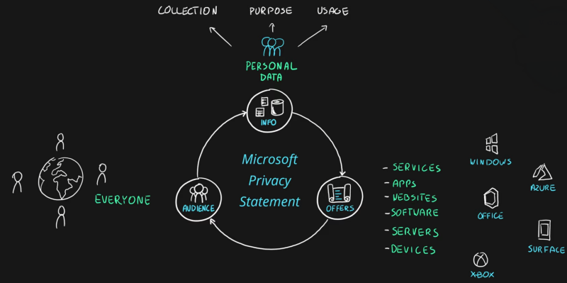

| Document/Website                   | Info                                                                                                                                     | Offers                                                                                      | Audience                                                                             |
| ---------------------------------- | ---------------------------------------------------------------------------------------------------------------------------------------- | ------------------------------------------------------------------------------------------- | ------------------------------------------------------------------------------------ |
| **Microsoft Privacy Statement**    | Collection, Purpose and Usage of Personal Data                                                                                           | All Microsoft offers including services, applications, websites, software, servers, devices | Everyone - end customers or companies                                                |
| **Online Services Terms** (OST)    | Licensing Terms (legal agreement) - usage rights about Azure services. What can be done and what is forbidden.                           | Microsoft Online Services like Azure, Microsoft 365 services, Bing Maps, etc.               | Organizations - legal teams                                                          |
| **Data Protection Addendum**       | Appending to OST describing obligations by both parties (Microsoft and you) with regards to the processing of customer and personal data | Microsoft Online Services like Azure, Microsoft 365 services, Bing Maps, etc.               | Organizations - legal teams, security teams                                          |
| **Trust Center**                   | One stop shop web portal for everything related to security, compliance, privacy, policies, best practices, etc.                         | Microsoft Online Services like Azure, Microsoft 365 services, Bing Maps, etc.               | Organizations - legal teams, security teams, business managers, administrators       |
| **Azure Compliance Documentation** | Web portal focusing on compliance offerings in Azure, simmilar to the trust center but narrowed down                                     | Azure                                                                                       | Organizations - legal teams, security teams, business managers, Azure administrators |

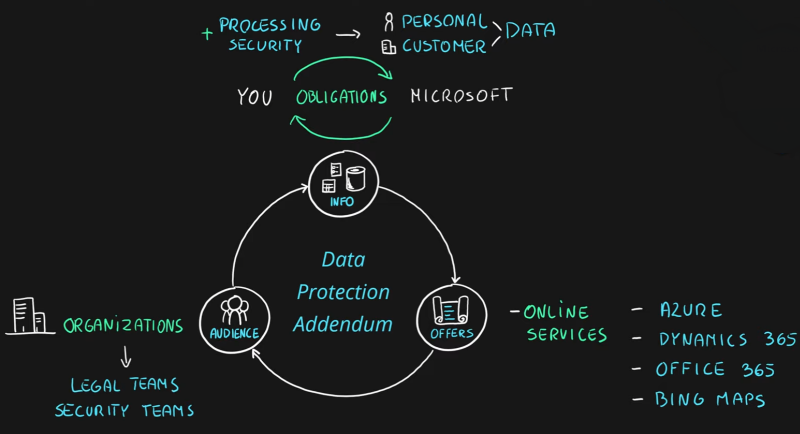

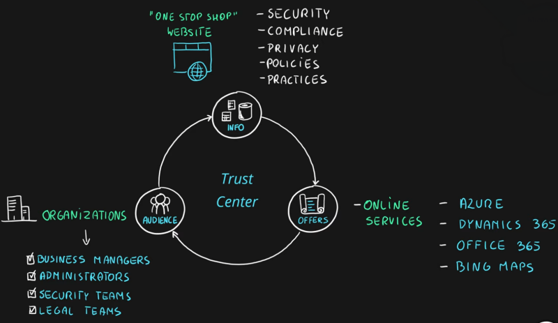

#### Azure Sovereign Regions

Azure Sovereign Regions provide Azure services in markets with very strict regulatory requirements

- Azure Government designed for the US government
  - Separate instance of Azure (lifecycle, services, portal, etc.)
  - Physically isolated from other Azure regions
  - Only autorized scanned personel can get access
- Azure China designed for the Chinese market
  - Separate instance of Azure (lifecycle, services, portal, etc.)
  - Physically isolated from other Azure regions
  - Operated by a Chinese telecom company called 21Vianet

## Module 4

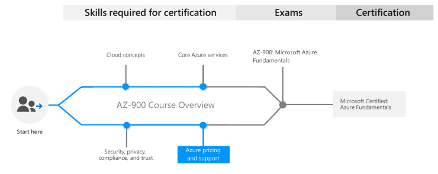

Describe Azure cost management and Service Level Agreements (10-15%)
Describe methods for planning and managing costs

### Episode 35: Cost Affecting Factors

- Base Cost

  - **Resource Types** – All Azure services (resources) have resource-specific pricing models. - Typically consisting of one or more metrics.

    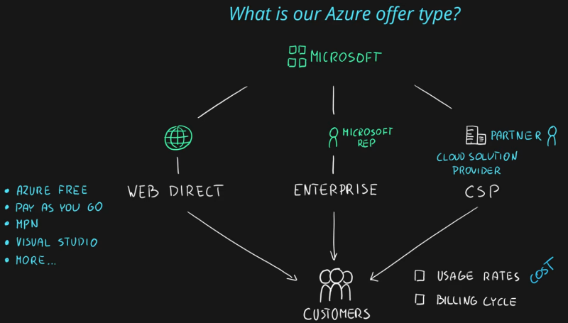

  - **Services** – Azure specific offers (Enterprise, Web Direct, CSP, etc.) have different cost and - billing components like prepaids, billing cycles, - discounts, etc.

    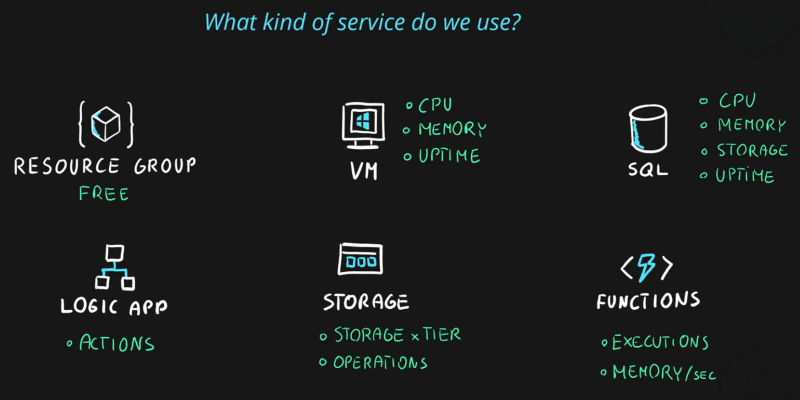

  - **Location** – running Azure services vary between Azure regions

    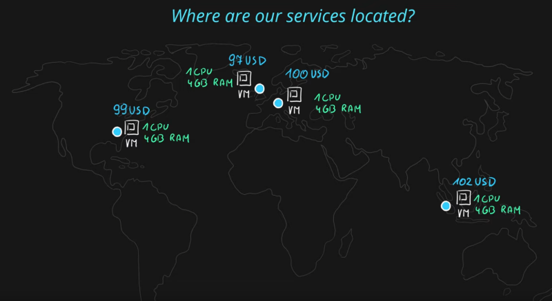

  - **Bandwidth** – network traffic when uploading (inbound/ingress) data to Azure or downloading - (outbound/egress) from Azure

    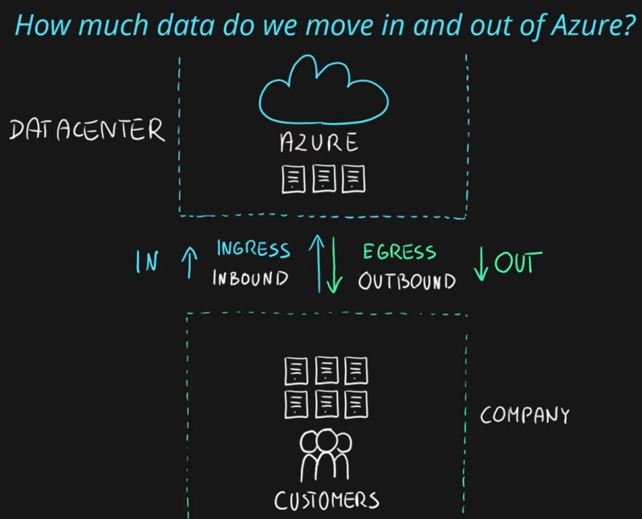

- Savings

  - Reserved Instances
  - Hybrid Benefits

### Episode 36: Cost Reduction Methods and Pricing, TCO Calculators

#### Azure Reservations

Purchase Azure services for 1 or 3 years in advance with a significant discounts

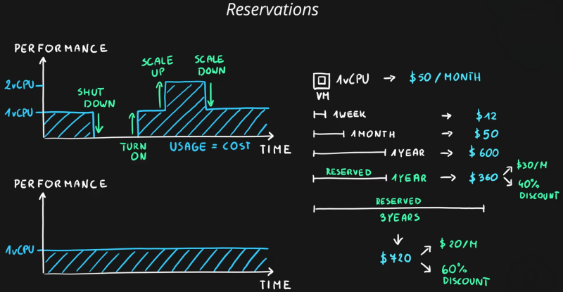

- **Reserved instances** – Azure Virtual Machines
- **Reserved capacity** – Azure Storage, SQL Database vCores, Databricks DBUs, Cosmos DB RUs
- **Software plans** – Red Hat, Red Hat OpenShift, SUSE Linux, etc.
- **Reservations** are made for 1 or 3 years

#### Azure Spot VMs

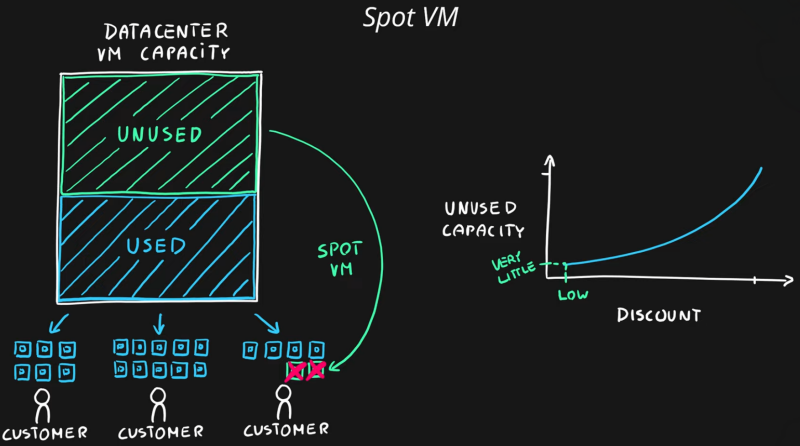

Purchase unused Virtual Machine capacity for significant discount

- How it works
  - **Significant discount** for Azure VMs
  - **Capacity** can be **taken away at any time**
  - Customer can **set maximum price** after discount to keep or evict the machine
- **Best for interruptable workloads** (batch processing, dev/test environments, large compute workloads, non-critical tasks, etc.)

#### Hybrid use Benefit

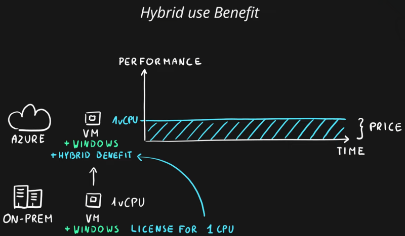

Use existing licenses in the cloud

- Use existing licenses in the Azure
  - **Windows Server**
    - Azure VM
  - **RedHat**
    - Azure VM
  - **SUSE Linux**
    - Azure VM
  - **SQL Server**
    - Azure SQL Database
    - Azure SQL Managed Instance
    - Azure SQL Server on VM
    - Azure Data Factory SQL Server Integration Services

#### Tools

- **Pricing calculator** – estimate the cost of Azure services
  - Select service
  - Adjust parameters (usage)
  - View the price
- **Total Cost of Ownership (TCO) calculator** – estimate and compare the cost of running - workloads in datacenter versus Azure
  - Define your workloads
  - Adjust assumptions
  - View the report

### Episode 37: Azure Cost Management

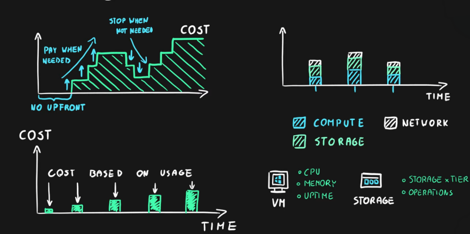

#### Azure Cost Management

- A centralized service for reporting usage and billing of Azure environment
- Self-service cost exploration capabilities
- Budgets & alerts
- Cost recommendations
- Automated exports

#### Minimizing Costs in Azure

1. Azure Pricing Calculator to choose the low-cost region
   - Good latency
   - All required services are available
   - Data sovereignty/compliance requirements
2. Hybrid use benefit and Azure Reservations
3. Azure Cost Management monitoring, budgets, alerts and recommendations
4. Understand service lifecycle and automate environments
5. Use autoscaling features to your advantage
6. Azure Monitor to find and scale down underutilized resources
7. Use tags & policies for effective governance

### Episode 38: Azure Service Level Agreement (SLA)

#### SLA

**Service Level Agreement** (SLA) is a formal agreement between a service provider and a customer.

**SLA** is a **promise** of a service’s **availability** (uptime & connectivity). **Availability** is a measure of time that a service remains operational.

- Each Service has its own SLA
- Ranges from 99% to 99.999%
- Free services typically don’t have an SLA
- Broken SLA means service credit return (discount)

| SLA     | Monthly Downtime |
| ------- | ---------------- |
| 99%     | 7h 18m 17s       |
| 99.5%   | 3h 39m 8s        |
| 99.9%   | 43m 49s          |
| 99.95%  | 21m 54s          |
| 99.99%  | 4m 22s           |
| 99.999% | 26s              |

#### Formulas

##### Logical AND - adding dependency

Availability of **S1 AND S2** = Availability(S1) \* Availability(S2)

##### Scenario - Azure website with SQL backend db

- Availability = Availability(web) app \* Availability(sql)
- Availability = 99.95% \* 99.95%
- Availability = 0.9995 \* 0.9995
- Availability = 0.99900025
- Availability ~ 99.9%

##### Logical OR - adding redundancy

Availability of S1 OR S2 = 100% - ( Unvailability(S1) \* Unvailability(S2) )

##### Scenario - Two redundant web apps behind a load balancer

- Availability(both-web) = 100% - ( Unvailability(web1) \* Unvailability(web2) )
- Availability(both-web) = 100% - ( 0.05% \* 0.05% )
- Availability(both-web) = 1 – ( 0.0005 \* 0.0005 )
- Availability(both-web) = 1 – 0.00000025
- Availability(both-web) = 0.99999975
- Availability(both-web) ~ 99.9999%

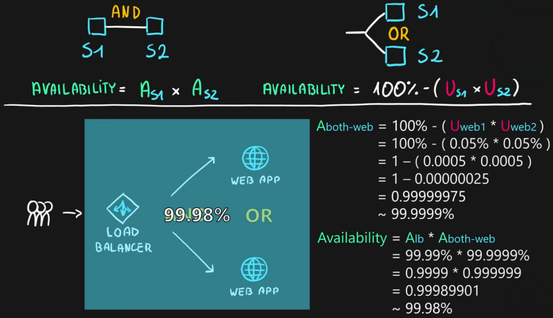

#### Key Items

- **Formal agreement** between **Microsoft** & the **customer**
- Calculated as a **percentage of service availability** (**uptime** & **connetivity**) (a promise)
- Breaking the SLA provides a discount from the final monthly bill (**Service Credit**)
- **Higher tier** services offer better **SLAs**
- **Free** services typically have **no SLA** (0% SLA)
- **Preview** services have **no SLA**
- **Composite SLA** is a combined SLA of all application components

### Episode 39: Service lifecycle in Azure

#### Service Lifecycle

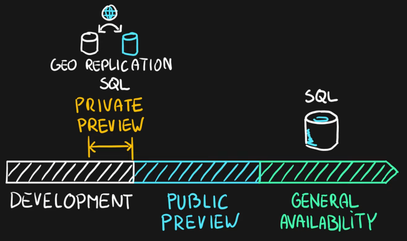

- Every service in Azure follows its own service lifecycle
- **Public preview** is a ‘**beta**’ stage of the service available to general public use
- **Features** can also be in **preview** stages
- Designed for **testing**, **not production** solutions
- **General availability** is a ‘**production**’ release of the service

#### Public Preview Key Info

- No SLA
- Some services have no support coverage
- Limited region availability
- Limited functionality
- Pricing changes
- Direction changes
- [Azure Portal Previews](https://preview.portal.azure.com)
