# AZ-900 Notes

  

## Value

Azure Fundamentals provides the most expansive view of Cloud architecture and Azure.

NOTE: Bird's-eye view - think foundation.

## Length of Study

---

## Why Cloud Computing?

1. High Speed - Quick Deployment
2. Automatic Software Updates and Integration
3. Efficiency and Cost Reduction
4. Unlimited Storage Capacity
5. Scalability

## Cloud Hosting Evolution

### Dedicated Server

- One physical machine dedicated to a single business.
- Runs a single web-app/site.
- **Very expensive, High Maintenace, High Security**

### Virtual Private Server (VPS)

- One physical machine dedicated to a single business.
- The physical machine is virtualized into sub-machines.
- Runs multiple web-apps/sites.
- **Better utilization and isolation of resources.**

### Shared Hosting

- One physical machine, shared by hundreds of businesses.
- Relies on most tenants under-utilizing their resources.
- Very cheap, limited functionality, poor isolation.

### Cloud Hosting

- Muliple physical machines that act as one system.
- The system is abstracted into multiple cloud services.
- **Flexible, scalable, secure, cost-effective, high configurability.**

## Common Cloud Services

A cloud provider can have hundreds of cloud services that are grouped various types of services. The four most common types of cloud services for Infrastructure as a Service (IaaS) would be:

- Compute
- Storage
- Networking
- Databases

The term "cloud computing" can be used to refer to all categories, even though it has "compute" in the name.

### Compute

- Imagine having a virtual computer that can run applications, programs, and code.

### Storage

- Imagine having a virtual hard-drive that can store files.

### Networking

Imagine having a virtual network being able to define internet connections or network isolations.

### Databases

Imagine a virtual database for storing reporting data or a database for general purpose web-application.

## Essential Azure Services

### Compute

**Azure VM** – A virtual server that supports both Linux and Windows operating systems. You can allow or deny the traffic going to your VMs using a network security group.
Azure Functions – A serverless compute that allows you to write functions using C#, Java, JavaScript, Python, and PowerShell.
Azure Kubernetes Service – It allows you to orchestrate and manage multiple containers, but the control plane and worker nodes upgrades are done manually.

### Storage

**Azure Blob** – An object storage service of Azure. A single blob container size is the same as the maximum storage account capacity.
Azure Disk – A block storage for virtual machines. You can protect your disks from failure with the data redundancy feature.
Azure Files – It enables you to mount file shares in popular operating systems such as Linux, Windows, and macOS.

### Database

**Azure SQL Database** – A relational database service that supports Microsoft SQL server.
Azure Cosmos DB – A database service for document store, graph DBMS, key-value, and wide column store.

### Networking

**Azure VNet** – A private network to run your VMs and applications. You can segment your virtual network between a /16 and /29 netmask.
Azure CDN – It enables you to deliver web content closer to users. It has multiple point-of-presence locations in a region.
Azure Traffic Manager – Distribute incoming traffic based on the routing method of your choice and Azure DNS helps you manage your DNS records.

### Security

**Azure Active Directory** – An identity and access management service that allows you to create and manage users and groups. You can use RBAC to grant users certain roles to access specific resources.
Azure Key Vault – A service that allows you to store tokens, passwords, certificates, and other secrets. You can also create and manage the keys used to encrypt your data.
Azure Application Gateway – A web traffic load balancer for the distribution of HTTP requests. It also has a web application firewall that protects your web applications from commonly known vulnerabilities.

## Cloud Services Models

<table class="tg">
<thead>
  <tr>
    <th class="tg-0lax">SaaS </th>
    <th class="tg-0lax">PaaS</th>
    <th class="tg-0lax">IaaS</th>
  </tr>
</thead>
<tbody>
  <tr>
    <td class="tg-0lax">SaaS is a cloud-hosted, ready-to-use application software.
    <b>Don't worry about how the service is maintained. It just works and remains available.</b></td>
    <td class="tg-0lax">PaaS provides a cloud-based platform for developing, running, and managing applications.
    <b>Don't worry about, provisioning, configuring, or understanding the hardware or OS.</b></td>
    <td class="tg-0lax">IaaS is a type of cloud computing service that offers essential compute, storage, and networking resources on demand, on a pay-as-you-go basis.
    <b>Don't worry about IT staff, data centers and hardware.</b></td>
  </tr>
  <tr>
    <td class="tg-0lax">
    
    
    
    </td>
    <td class="tg-0lax"></td>
    <td class="tg-0lax">
    
    
    </td>
  </tr>
</tbody>
</table>

## Benefits of Cloud Computing

| Benefit        | Desc.                                                                                                                             |
| -------------- | --------------------------------------------------------------------------------------------------------------------------------- |
| Cost-effective | You pay for what you consume, no up-front cost. Pay-as-you-go (PAYG) thousands of customers sharing the cost of resources.        |
| Global         | Launch workloads anywhere in the world, just choose a region.                                                                     |
| Reliable       | data backup, disaster recovery, and data replication, and fault tolerance                                                         |
| Scalable       | Increase or decrease resources and services based on demand                                                                       |
| Elastic        | Automate scaling during spikes and drop in demand                                                                                 |
| Current        | The underlying hardware and managed software is patched, upgraded and replaced by the cloud provider without interruption to you. |

## What is Azure?

Azure is Microsoft's cloud computing platform with an ever-expanding services to help build solutions to meet your business goals.

## Azure Benefits

- High Availability / Disaster recovery
- Security
- Enhanced Flexibility
- Low Cost
- Speed

## Azure Cloud Service Models

The three cloud computing service models are IaaS, PaaS, and SaaS.
You can also use serverless computing to eliminate the need to manage infrastructure.
The shared responsibility model determines the security tasks that are handled by the cloud provider and handled by the customer.
Azure is responsible for protecting the infrastructure such as hosts, network, and data center.
The customer is responsible for protecting their data, endpoints, account, and access management.
IaaS, PaaS, and SaaS have different levels of managed services:

## Cloud Computing Responsibilities

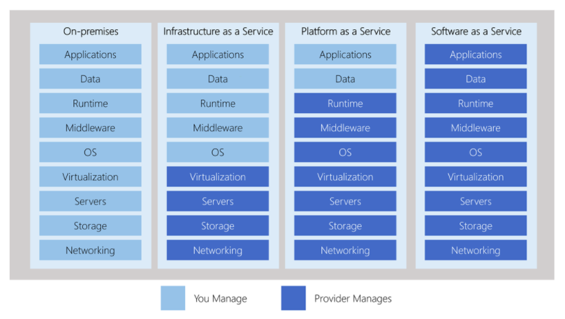

## Azure's Deployment Models

### Public Cloud

<b>Everything</b> built on the Cloud Provider
Also known as: Cloud-Native

### Private Cloud

Everything built on company's datacenter
Also known as <b>On-Premise</b>
The Cloud could be <b>OpenStack</b>

### Hybrid

Using both <b>On-Premise</b> and a <b>Cloud Service Provider</b>

<table class="tg">
<thead>
  <tr>
    <th class="tg-0lax"></th>
    <th class="tg-0lax">Cost</th>
    <th class="tg-0lax">Security</th>
    <th class="tg-0lax">Level of Configuration</th>
    <th class="tg-0lax">Technical Knowledge</th>
  </tr>
</thead>
<tbody>
  <tr>
    <td class="tg-0lax">Public Cloud</td>
    <td class="tg-zgh4">👍 Most cost-effective</td>
    <td class="tg-ra6b">👍- Security controls by default 👎 - Might not meet security requirements</td>
    <td class="tg-1zak">👎 Limited based on what the Cloud Service Provider exposes to you</td>
    <td class="tg-zgh4">👍 You don't need in-depth knowledge of underlying infrastructure</td>
  </tr>
  <tr>
    <td class="tg-0lax">Private Cloud</td>
    <td class="tg-1zak">👎 Most Expensive</td>
    <td class="tg-ra6b">👎 - No guarantee its secure 👍 - Can meet any security compliance requirement if you put in the work</td>
    <td class="tg-zgh4">👍 You can configure the infrastructure however you like</td>
    <td class="tg-1zak">👎 You need to know in-depth knowledge to configure all levels of your instance</td>
  </tr>
  <tr>
    <td class="tg-0lax">Hybrid Cloud</td>
    <td class="tg-ra6b">👍 Could be more cost-effective based on what you offload to the cloud</td>
    <td class="tg-ra6b">👎 - You now have to secure your connection to the cloud 👍 - Can meet all security requirements</td>
    <td class="tg-zgh4">👍 You get the best of both worlds</td>
    <td class="tg-1zak">👎 You need to know in-depth how to configure all levels of your infrastructure and know all the CSPs services.</td>
  </tr>
</tbody>
</table>

## Total Cost of Ownership (TCO)

### CAPEX

On-Premise

- Implementation
- Configuration
- Training
- Physical Security
- Hardware
- IT Personnel
- Maintenance

<b>Azure's Responsibility</b>

### OPEX

Azure

- Subscription Fees
- Implementation
- COnfiguration
- Training

<b>= 75% Savings</b>

## Capital vs Operational Expenditure

### Capital Expenditure (CAPEX)

<mark>**Spending money upfront**</mark> on physical infrastructure deducting that expense from your tax bill over time.

- Server Costs (computers)
- Storage Costs (hard drives)
- Network Costs (Routers, Cables, Switches)
- Backup and Archive Costs
- Disaster Recovery Costs
- Datacenter Costs (Rent, Cooling, Physical Security)
- Technical Personnel

With Capital Expenditures <b>you have to guess upfront</b> what you plan to spend

### Operational Expenditure (OPEX)

The costs associated with an on-premises datacenter that has shifted the cost to the service provider. The customer only has to be concerned with non-physical costs.

- Leasing Software and Customizing features
- Training Employees in Cloud Services
- Paying for Cloud Support
- Billing based on cloud metrics eg.
  - compute usage
  - storage usage

With Operation Expenses you can try a product or service <b>without investing in equipment</b>

## Cloud Architecture Terminologies

### Solutions Architect

A role in a technical organization that architects a technical solution using multiple systems via researching, documentation, and experimentation.

### Cloud Architect

A solutions architect that is focued solely on architecting techniceal solutions using cloud services.

A cloud architect needs to understand the followikng terms and factor them into their designed architecture based on the business requirements.

- **Availability** - Your ability to ensure a service available eg. Highly available (HA)
- **Scalability** - Your ability to grow rapidly or unimpeded
- **Elasticity** - Your ability to shrink and grow to meet the demand
- **Fault Tolerance** - Your ability to prevent a failure
- **Disaster Recovery** - Your ability to recover from a failure eg. Highly Durable (DR)

A Solutions Architect needs to always consider the following business factors:

- Security - how secure is this solution?
- Cost - how much is this going to cost?

## High Availability

Your ability for your service to <b>remain available</b> by ensuring there is <mark>no single point of failure</mark> and/or ensure a certain level of performance.

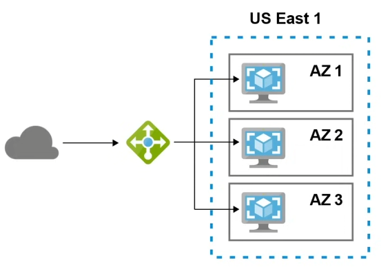

Running your workload across multiple **Available Zones** ensures that if 1 or 2 AZs become unavailable, your service/applications remains available.

### Azure Load Balancer

A load balancer allows you to evenly distribute traffic to multiple servers in one or more datacenter. If a datacenter or server becomes unavailable (unhealthy) the load balancer will route the traffic to only available datacenters with servers.

## High Scalability

Your ability to <b>increase your capacity</b> based on the increasing demand of traffic, memory, and computing power.

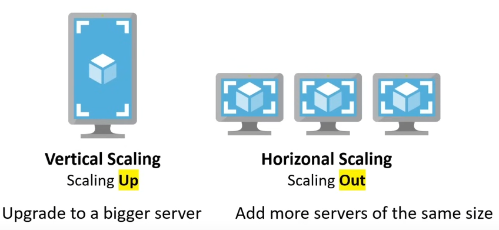

## High Elasticity

Your ability to <b>automatically</b> increase or decrease your capacity based on the current demand of traffic, memory, and computing power

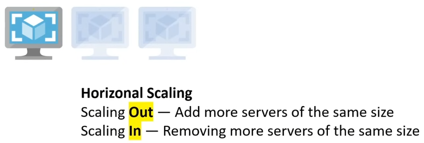

### Azure VM Scale Sets

Automatically increase or decrease in response to demand or a defined schedule.

### SQL Server Stretch Database

Dynamically stretch warm and cold transactional data from Microsoft SQL Server 2016 to Microsoft Azure

Vertical Scaling is generally hard for traditional architecture so you'll usually only see horizontal scaling described with Elasticity.

## Highly Fault Tolerant

Your ability for your service to ensure there is <mark>no single point of failure</mark>. <b>Preventing</b> the chance of failure.

### Fail-overs

When you have a plan to shift traffic to a redundant system in case the primary system fails.

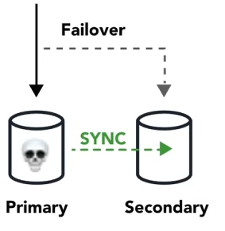

A common example is having a copy (secondary) of your database where all ongoing changes are synced. The secondary system is not in-use until a fail over occurs and it becomes the primary database.

You can use **Azurre Traffic Manager** which is a DNS-based traffic balancer to fail-over from a failing primary system to a stand-by secondary system.

## High Durability

Your ability to <b>recover</b> from a disaster and to prevent <b>the loss</b> of data. Solutions that recover from a disaster is known as <mark>**Disaster Recover (DR)**</mark>

- Do you have a backup?
- How fast can you restore that backup?
- Does your backup still work?
- How do you ensure current live data is not corrupt?

## Business Continuity Plan (BCP)

A **business continuity plan** (BCP) is a document that outlines how a business will continue operating <b>during an unplanned disruption in services</b>.

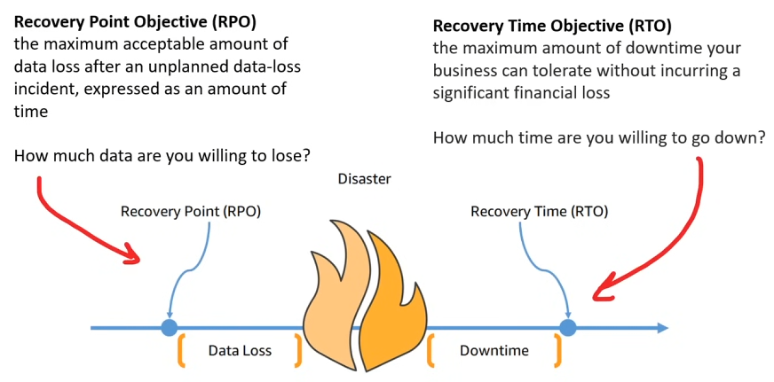

## Disaster Recovery Options

There are multiple options for recovery that trade cost vs time to recover.

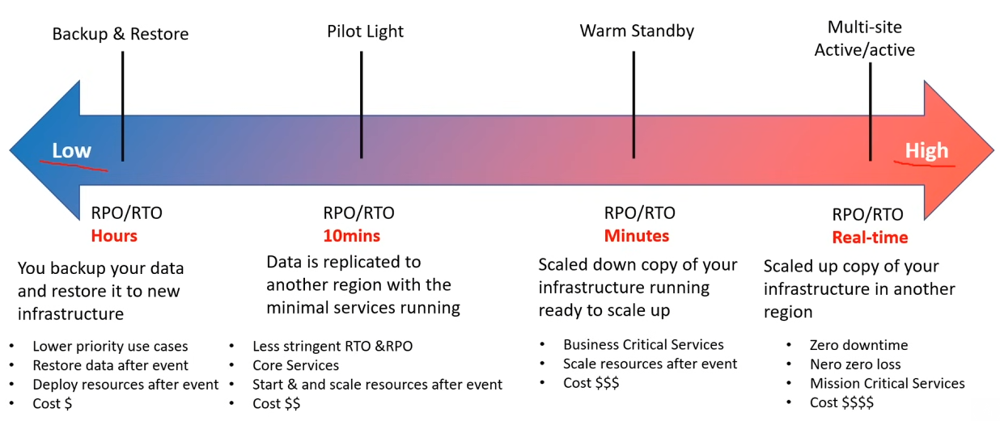

## Evolution of computing

### Dedicated Server

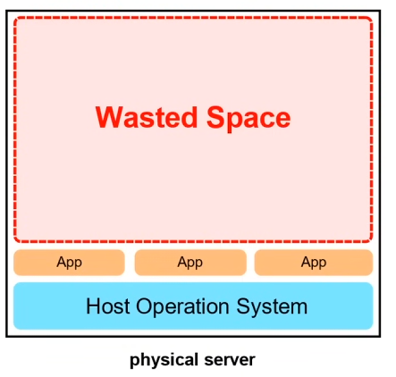

- A physical server <b>wholly utilized by a single customer</b>
- you have to guess your capacity, you'll overpay for an underutilized server
- upgrading beyond your capacity will be slow and expensive
- you are limited by your Operating System
- multiple apps can result in conflicts in resource sharing
- you have a <b>guarantee of security, privacy, and full utility of underlying resources</b>

### Virtual Machines (VMs)

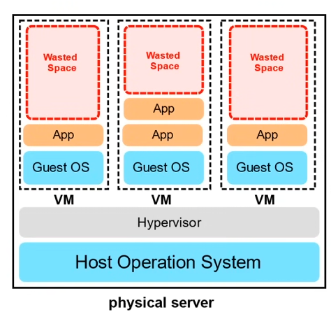

- You can run <b>multiple Virtual Machines on one machine</b>
- <mark>**Hypervisor**</mark> is the software layer that lets you run the VMs
- A physical server shared by multiple customers
- You are paying for a fraction of the server
- You'll overpay for an underutilized Virtual Machine
- You are limited by your Guest Operating System
- Multiple apps on a single Virtual Machine can result in conflicts in resource sharing

## Containers

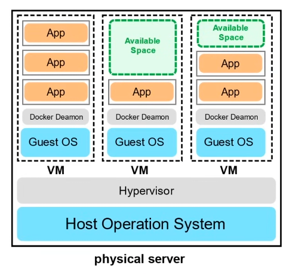

- Virtual Machine running multiple containers
- <mark>**Docker Deamon**</mark> is the name of the software layer that lets you run multiple containers
- You can maximize the utility of the available capacity which is more cost-effective
- Your containers share the same underlyingg OS so containers are more efficient than multiple VMs
- Multiple apps can run side by side without being limited to the same OS requirements and will not cause conflicts during resource sharing

## Functions

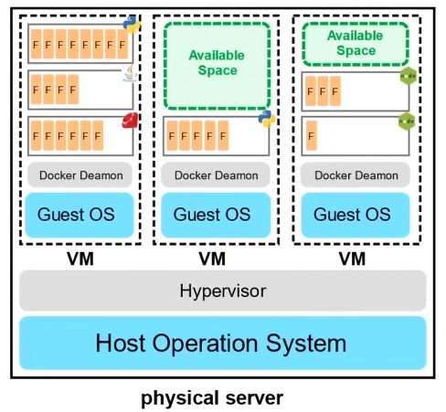

- A managed VM running managed containers
- Known as <b>Serverless Compute</b>
- You upload a piece of code you choose the amount of memory and duration
- Only responsible for code and data, nothing else
- Very cost-effective, only pay for the time the code is running, VMs only run when there is code to be executed
- Cold Starts is a side-effect of this setup

## Global Infrastructure - Regions and Geographies

A <b>region</b> is a grouping of multiple datacenters (Availabiltiy Zones)

Azure has 58 Regions available across 140 Countries

A <b>Geography</b> is discreet market of two or more regions that preserves **_data residency_** and **_compliance boundaries_**.

### Azure Geographies

- United States
- Azure Government (US)
- Canada
- Brazil
- Mexico

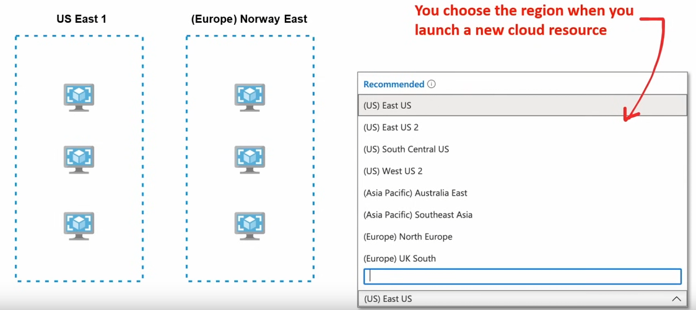

## Paired Regions

Each region is paired with another region <b>300 miles</b> away.

Only one region is updated at a time to ensure no outages.

Some Azure Services rely on Paired Regions for <mark>**Disaster Recovery**</mark>

eg. **Azure Geo-redundant Storage (GRS)** replicates data to a secondary region automatically ensuring that data is durable even in the event that the region isn't recoverable.

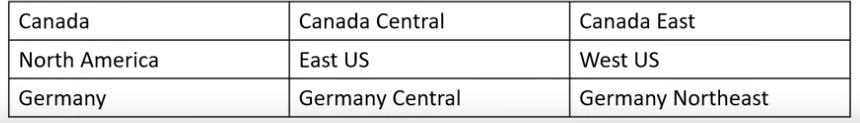

## Global Infrustrature - Region Types and Service Availability

**Not all Azure Cloud Services** are available in every region.

### Recommended region

A region that provides the broadest range of service capabilities and is <b>designed to support Availability Zones</b> now, or in the future.

### Alternate (other) region

A region that extends Azure's footprint within a dat residency boundary where a recommended region also exists. <b>Not designed to support AZs</b>.

These Regions are labeled as <mark>**Other**</mark> in the Azure Portal.

General availability (GA) is when a service is considered ready to be used publicly by everyone.

Azure Cloud Services are grouped into three categories.
Their category determines when cloud services become available:

1. **Foundational**. When GA, immediately or in 12 months in the Reommended and Alternate Regions
2. **Mainstream**. When GA immediately or in 12 months in Recommended Regions. May become available in Alternate Regions based on customer demand.
3. **Specialized**. Available in Recomemmeded or Alternate Region based on customer demand.

## Global Infrastrucure - Special Regions

Azure has specialized regions to meet <mark>**compliance or legal reasons**</mark>.

- US DoD Central
- US Gov Virginia
- US Gov Iowa

<b>Three Azure Government secret locations undisclosed</b>

- China East
- China North

<b>Available through a unique partnership between Microsoft and 21Vianet. Microsoft does not directly maintain the datacenters.</b>

## Global Infrastructure - Availability Zones

An <b>Availability Zone</b> (AZ) is physical location made up of one or more datacenter.

A datacenter is a secured building that contains hundreds or thousands of computers.

A region will <mark>**generally**</mark> contain **3 Availability Zones**

Datacenters within a region will be isolated from each other (so different buildings). But they will be close enough to provide low-latency.

Its common practice to run workloads in at least 3 AZs to ensure services remain available in case one or two datacenters fail. (High Availability)

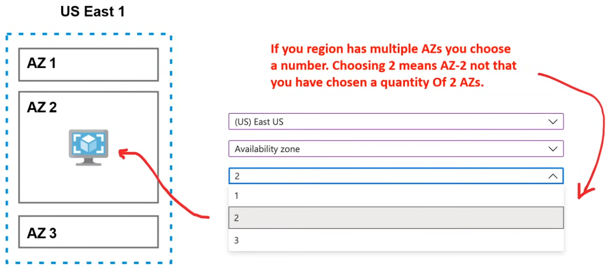

## Global Infrastructure - AZ Supported Regions

Not every Region has support for Availability Zones

These regions are known as <mark>**Alternate**</mark> or <mark>**Other**</mark>

Recommended Regions are suppose to have at least 3 AZs.

The following Regions <b>have a minimum of 3 AZs</b>:

- Central US
- East US
- West US
- West Europe
- France Central
- North Europe
- Southeast Asia

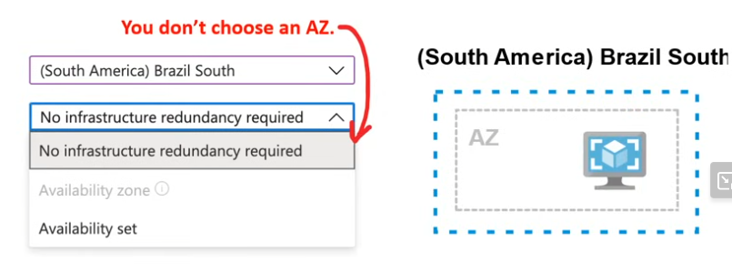

## Global Infrastructure - Fault and Update Domains

An availability Zone (AZ) in an Azure region is <b>a combination of</b> a <mark>**fault domain**</mark> and an <mark>**update domain**</mark>.

### Fault Domain

A logical grouping of hardware to avoid a single point of failure within an AZ. Group of virtual machines that share a common power source and network switch.

### Update Domain

Azure may need to apply updates to the underlying hardware and software. Update domains ensure your resources do not go offline.

### Availabilty Set

A logical grouping that you can use in Azure to ensure that the VMs you place in the Availability Set are different fault/update domains to avoid downtime.

**Each Virtual Machine** in an Availability Set is assigned a Fault Domain and Update Domain.

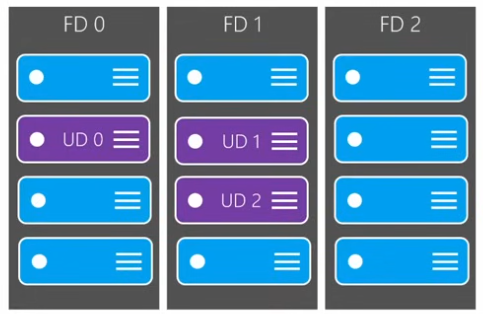

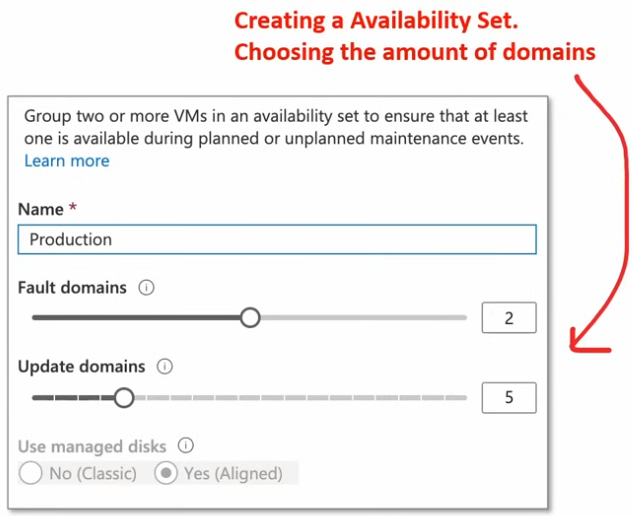
