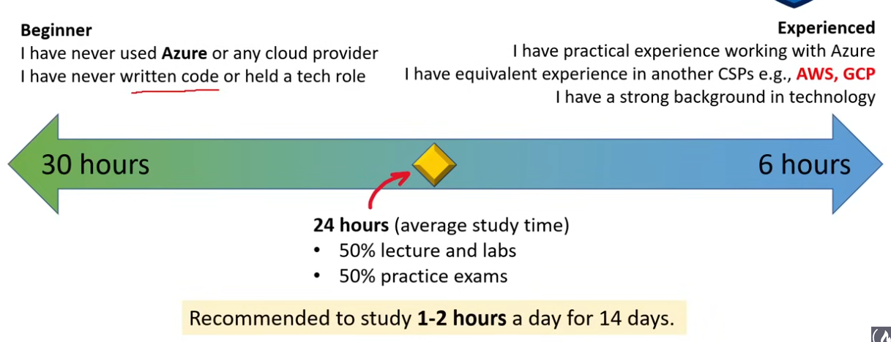
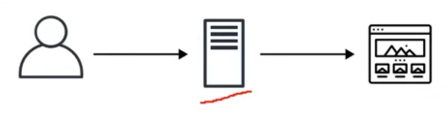
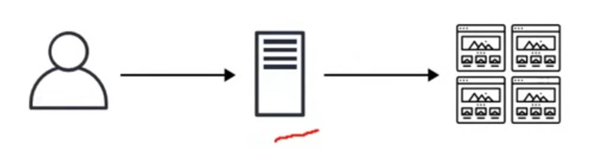
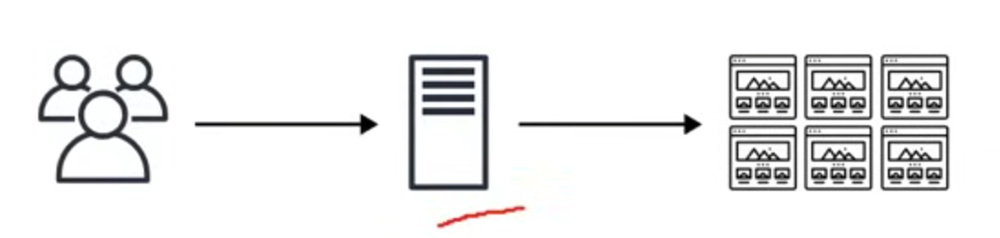
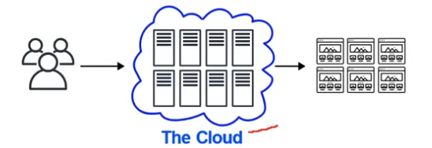
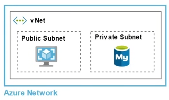
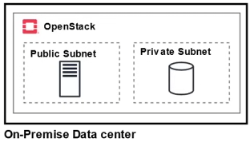
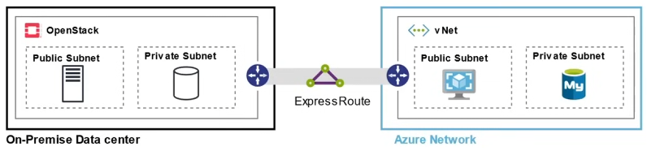

# AZ-900 Notes

  

## Value

Azure Fundamentals provides the most expansive view of Cloud architecture and Azure.

NOTE: Bird's-eye view - think foundation.

## Length of Study

---

## Why Cloud Computing?

1. High Speed - Quick Deployment
2. Automatic Software Updates and Integration
3. Efficiency and Cost Reduction
4. Unlimited Storage Capacity
5. Scalability

## Cloud Hosting Evolution

### Dedicated Server

- One physical machine dedicated to a single business.
- Runs a single web-app/site.
- **Very expensive, High Maintenace, High Security**

### Virtual Private Server (VPS)

- One physical machine dedicated to a single business.
- The physical machine is virtualized into sub-machines.
- Runs multiple web-apps/sites.
- **Better utilization and isolation of resources.**

### Shared Hosting

- One physical machine, shared by hundreds of businesses.
- Relies on most tenants under-utilizing their resources.
- Very cheap, limited functionality, poor isolation.

### Cloud Hosting

- Muliple physical machines that act as one system.
- The system is abstracted into multiple cloud services.
- **Flexible, scalable, secure, cost-effective, high configurability.**

## Common Cloud Services

A cloud provider can have hundreds of cloud services that are grouped various types of services. The four most common types of cloud services for Infrastructure as a Service (IaaS) would be:

- Compute
- Storage
- Networking
- Databases

The term "cloud computing" can be used to refer to all categories, even though it has "compute" in the name.

### Compute

Imagine having a virtual computer that can run applications, programs, and code.

### Storage

Imagine having a virtual hard-drive that can store files.

### Networking

Imagine having a virtual network being able to define internet connections or network isolations.

### Databases

Imagine a virtual database for storing reporting data or a database for general purpose web-application.

## Cloud Services Models

<table class="tg">
<thead>
  <tr>
    <th class="tg-0lax">SaaS </th>
    <th class="tg-0lax">PaaS</th>
    <th class="tg-0lax">IaaS</th>
  </tr>
</thead>
<tbody>
  <tr>
    <td class="tg-0lax">SaaS is a cloud-hosted, ready-to-use application software.
    <b>Don't worry about how the service is maintained. It just works and remains available.</b></td>
    <td class="tg-0lax">PaaS provides a cloud-based platform for developing, running, and managing applications.
    <b>Don't worry about, provisioning, configuring, or understanding the hardware or OS.</b></td>
    <td class="tg-0lax">IaaS is a type of cloud computing service that offers essential compute, storage, and networking resources on demand, on a pay-as-you-go basis.
    <b>Don't worry about IT staff, data centers and hardware.</b></td>
  </tr>
  <tr>
    <td class="tg-0lax">
    
    
    
    </td>
    <td class="tg-0lax"></td>
    <td class="tg-0lax">
    
    
    </td>
  </tr>
</tbody>
</table>

## Benefits of Cloud Computing

| Benefit        | Desc.                                                                                                                             |
| -------------- | --------------------------------------------------------------------------------------------------------------------------------- |
| Cost-effective | You pay for what you consume, no up-front cost. Pay-as-you-go (PAYG) thousands of customers sharing the cost of resources.        |
| Global         | Launch workloads anywhere in the world, just choose a region.                                                                     |
| Reliable       | data backup, disaster recovery, and data replication, and fault tolerance                                                         |
| Scalable       | Increase or decrease resources and services based on demand                                                                       |
| Elastic        | Automate scaling during spikes and drop in demand                                                                                 |
| Current        | The underlying hardware and managed software is patched, upgraded and replaced by the cloud provider without interruption to you. |

## What is Azure?

Azure is Microsoft's cloud computing platform with an ever-expanding services to help build solutions to meet your business goals.

## Azure Benefits

- High Availability / Disaster recovery
- Security
- Enhanced Flexibility
- Low Cost
- Speed

## Cloud Computing Responsibilities

<table class="tg">
<thead>
  <tr>
    <th class="tg-0pky">On-Premise</th>
    <th class="tg-0pky">IaaS</th>
    <th class="tg-0pky">PaaS</th>
    <th class="tg-0pky">SaaS</th>
  </tr>
</thead>
<tbody>
  <tr>
    <td class="tg-ra6b">Applications</td>
    <td class="tg-djj2">Applications</td>
    <td class="tg-ra6b">Applications</td>
    <td class="tg-9rbh">Applications</td>
  </tr>
  <tr>
    <td class="tg-djj2">Data</td>
    <td class="tg-djj2">Data</td>
    <td class="tg-djj2">Data</td>
    <td class="tg-9rbh">Data</td>
  </tr>
  <tr>
    <td class="tg-djj2">Runtime</td>
    <td class="tg-djj2">Runtime</td>
    <td class="tg-9rbh">Runtime </td>
    <td class="tg-9rbh">Runtime</td>
  </tr>
  <tr>
    <td class="tg-djj2">Middleware</td>
    <td class="tg-djj2">Middleware</td>
    <td class="tg-9rbh">Middleware</td>
    <td class="tg-9rbh">Middleware</td>
  </tr>
  <tr>
    <td class="tg-djj2">OS</td>
    <td class="tg-djj2">OS</td>
    <td class="tg-9rbh">OS </td>
    <td class="tg-9rbh">OS</td>
  </tr>
  <tr>
    <td class="tg-djj2">Virtualization</td>
    <td class="tg-9rbh">Virtualization</td>
    <td class="tg-9rbh">Virtualization</td>
    <td class="tg-9rbh">Virtualization</td>
  </tr>
  <tr>
    <td class="tg-djj2">Servers</td>
    <td class="tg-9rbh">Servers</td>
    <td class="tg-9rbh">Servers</td>
    <td class="tg-9rbh">Servers</td>
  </tr>
  <tr>
    <td class="tg-djj2">Storage</td>
    <td class="tg-9rbh">Storage </td>
    <td class="tg-9rbh">Storage</td>
    <td class="tg-9rbh">Storage</td>
  </tr>
    <tr>
    <td class="tg-djj2">Networking</td>
    <td class="tg-9rbh">Networking </td>
    <td class="tg-9rbh">Networking</td>
    <td class="tg-9rbh">Networking</td>
  </tr>
</tbody>
</table>

<table class="tg">
<thead>
  <tr>
    <td class="tg-hfk9">Legend:</td>
    <td class="tg-ra6b">Customer is Responsibile</td>
    <td class="tg-ucgi">CSP is Responsible</td>
  </tr>
</thead>
</table>

## Azure's Deployment Models

### Public Cloud

<b>Everything</b> built on the Cloud Provider
Also known as: Cloud-Native

### Private Cloud

Everything built on company's datacenter
Also known as <b>On-Premise</b>
The Cloud could be <b>OpenStack</b>

### Hybrid

Using both <b>On-Premise</b> and a <b>Cloud Service Provider</b>

