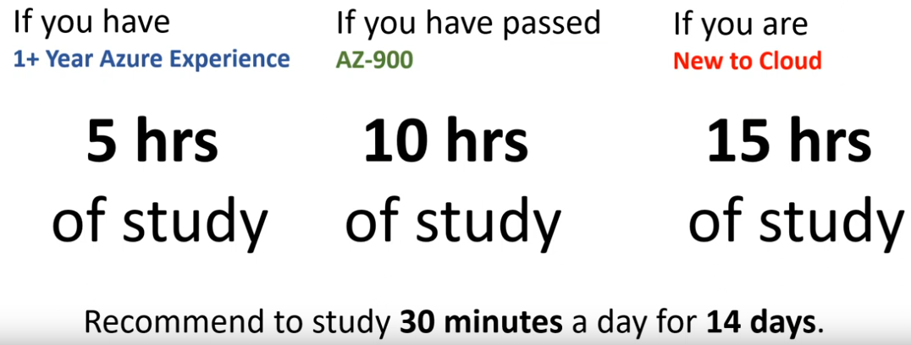

# DP-900 Notes

  

## Value

The Azure Data Fundamentals Certification is for those seeking a data-related role such as Data Analyst, Data Engineer, or Data Scientist

The certification will demonstrate a person can define and understand Core data concepts, Hadoop workloads, Apache Spark workloads, MS SQL databases, NoSQL databases, data lakes, data warehouses, ELTs and BigData Analytics

The natural parth for the Azure Data Engineer or the Azure Data Analyst

NOTE: Bird's-eye view of Azure Data

## Study Length

Link here: https://www.udemy.com/course/dp-900-azure-data-fundamentals-5-practice-tests/

I have organized my notes in accordance with the course content and Modules on Microsoft learn website.

## Explore Core Data Concepts:

- Data can be categorized into 3 types.
- Structured data — ex : tabular data in rows and columns
- Semi-structured data — ex : JSON, XML
- Unstructured data — ex: audio, video files, images etc.,
- Data is processed either in Batches or as in when the data arrives in real-time.
- Batch processing collects the data and then process it, on other hand streaming data processes it as in when data arrives.
- Batch processing data examples- CSV files, one months of sales date
- Stream processing data examples- online gaming data, data from sensors.
- Data processing solutions are of two broad categories: analytical systems, and transaction processing systems.

### Transactional system: (OLTP)

- Records transactions
- Transactions are a small, discrete unit of work in real time. Ex: bank transactions
- These systems are high-volume and handle millions of transactions in a single day

### Analytical systems:(OLAP)

- Concerned with capturing raw data, and using it to generate insights
- **Data ingestion** - process of collecting raw data from different sources
- **Data transformation** - convert the raw data into a meaningful data
- **Data querying** - To analyze the data and run ad-hoc queries
- **Data visualization** - generate reports, charts, plots for further data examination.

### Explore Relational DB in Azure

#### Azure SQL Database

- **Single Database** — dedicated resources and managed by azure. Scale manually.
- **Elastic pool** — similar to Single Database, except that by default multiple databases can share the same resources
- **Managed Instance** — fully controllable instance of SQL Server in the cloud, can install multiple databases on the same instance.

### Explore Non -relational DB in Azure

Below services are created on Azure using an azure storage account.

#### Azure table storage

- NoSQL key value model
- Stores semi-structured data
- All rows in table must have a key and the columns vary from row to -row(remember it is not a relational DB)
- No concept of relationships, Stored Procedures, indexes or FK’s (so data is de-normalized)
- for faster access, azure table storage splits its data into partitions.
- partitions helps group rows based on its keys and a table can have as many partitions as possible.
- So, a key in azure table storage has 2 parts to it. 1. partition key and 2. the row key that identifies the row uniquely.
- a table can have up to max of 252 columns
- max row size is 1MB

##### Advantages: Simple to scale

- row insertion and retrieval is faster
- supports huge volumes of data. As you add rows to a table,
- Azure Table Storage automatically manages the partitions in a table and -allocates storage as necessary. You don’t need to take any additional steps yourself.
- high availability

##### Disadvantages: There’s no referential integrity

- Consistency needs to be given consideration as transactional updates across multiple entities aren’t guaranteed
- Azure Table Storage is an excellent mechanism for:
- Examples include product catalogs for eCommerce applications, and customer information, where the data can be quickly identified and ordered by a composite key
- Capturing event logging and performance monitoring data
- if you need to analyze an ordered series of events and performance measures chronologically.

#### Azure Blob Storage

- allows to store unstructured data.
- for storing large binary object like images, audio files etc.

#### Three types of Blob

##### Block blob

- data is stored in blocks
- The block is the smallest amount of data that can be read or written as an individual unit
- Block blobs are best used to store discrete, large, binary objects that change infrequently.

##### Page Blob

- A page blob is optimized to support random read and write operations; you can fetch and store data for a single page if necessary.

##### Append Blob

- You can only add blocks to the end of an append blob; updating or deleting existing blocks isn’t supported.
- An append blob is a block blob optimized to support append operations

##### Blob storage has 3 access tiers

1. **Hot** — default one for frequently used data
2. **Cool** — infrequently used data
3. **Archive** — historic data

- Azure Blob Storage is an excellent mechanism for:
- streaming video and audio,
- Storing data for backup and restore, disaster recovery, and archiving
- Storing data for analysis by an on-premises or Azure-hosted service
- Other features available with Azure Blob storage include:

##### Versioning

- You can maintain and restore earlier versions of a blob

##### Soft delete

- This feature enables you to recover a blob that has been removed or overwritten, by accident or otherwise

- you can also Store, audit, and analyze changes to your objects, over any period of time

##### Snapshots

- A snapshot is a read-only version of a blob at a particular point in time

#### Azure File Storage:

- allows you to share files with both apps running on cloud and also on-premise.
- you can upload files from portal or AzCopyUtility. To use Copy utility you need to generate a SAS (Shared access signature) token using portal.
- Azure File Sync service to synchronize locally cached copies of shared files with the data in Azure File Storage.
- offers two performance tiers — standard and premium
- premium offers more throughput at higher cost.
- All data is encrypted at rest, and you can enable encryption for data in-transit between Azure File Storage and your applications.
- allows 2000 concurrent reads to a shared file, but writes must be carefully managed using Lock file mechanism to maintain data consistency.

#### Azure cosmos DB

- semi-structured data
- stores data as a partitioned set of documents. A document is a collection of fields, identified by a key.
- The fields in each document can vary, and a field can contain child documents.
- uses JSON to represent the document structure.
- Cosmos DB provides support for existing applications via API
  mongo DB API, Cassandra API, Gremlin API(Graph DB), SQL API and table API.
- Unlike Azure Table storage, documents in a Cosmos DB partition aren’t sorted by ID. Instead, Cosmos DB maintains a separate index
- advantages: scalable, high availability, auto Index management,
  supports five well-defined consistency choices — strong, bounded staleness, session, consistent prefix, and eventual.
- Cosmos DB is highly suitable for the following scenarios:
- IoT and telematics, Gaming, Retail and marketing, web and mobile apps.

### Explore modern data warehouse analytics in Azure

#### Azure Data Factory

- Its a data integration service. Does ETL / ELT
- Allows to get raw data in the form of batch/streaming data and helps clean and transform into meaningful data.
- It connects to different sources via Linked services.
- Its work is defined as a pipeline of operations (series of steps).
  pipelines can be triggered or run manually.
- Azure provides GUI for creating these pipelines.
- Azure Data Factory provides Poly Base support for loading data.
- Azure Data factory allows you to run your existing SSIS packages as part of a pipeline in the cloud via SSIS Feature Pack for Azure.
- SSIS Feature Pack for Azure support transfer to or from Azure storage, Azure Data Lake, and Azure HDInsight.

#### Azure Data Lake

- A repo for large raw data that is not processed. Easy to load and read
  it is a starting point for the ingested data to get stored.
- It organizes the data into directories and subdirectories
- Enables granular Role-Based Access Control (RBAC) on your data
- Is compatible with the Hadoop Distributed File System (HDFS)

#### Azure Data bricks

- It is a Apache Spark environment running on Azure to provide big data processing, streaming, and machine learning.
- It provides a graphical user interface where you can define and test your processing step by step.
- You can create Data bricks scripts and query data using languages such as R, Python, and Scala. You write your Spark code using notebooks.

#### Azure Synapse Analytics

- Analytics engine.
- you can ingest data from multiple sources, process it and transform the data for analytical purposes.
- It uses poly base that enables synapse to retrieve data from relational and non-relational sources, such as delimited text files, Azure Blob Storage, and Azure Data Lake Storage.
- Azure Synapse Analytics leverages massively parallel processing (MPP) architecture which includes a control node(master) and pool of compute nodes(salves).
- The master sends the queries to be executed to the compute nodes, and the results are then sent back to the control node.
- Azure Synapse Analytics supports two computational models: SQL pools and Spark pools.
- You can only scale a SQL pool when it’s not running a Transact-SQL query.

In a Spark pool, the nodes are replaced with a Spark cluster you can run jobs on these spark nodes just like you run notebooks in data bricks.

- SQL pool — can add more nodes manually
- Spark pool — auto scaling of nodes is enabled
- Azure Synapse Analytics can consume a lot of resources.
- If you aren’t planning on performing any processing for a while, you can pause the service.
- This action releases the resources in the pool to other users, and reduces your costs.

#### Azure Analysis

- It does everything a synapse service can do but at a smaller scale and additional allows visualization of data
- Smaller volumes of data (a few terabytes)
- Multiple sources that can be correlated
- High read concurrency (thousands of users)
- Detailed analysis, and drilling into data, using functions in Power BI
- Rapid dashboard development from tabular data

#### Azure HD Insight

- This is similar to that used by Synapse Analytics, except that the nodes are running the Spark processing engine rather than Azure SQL Database
