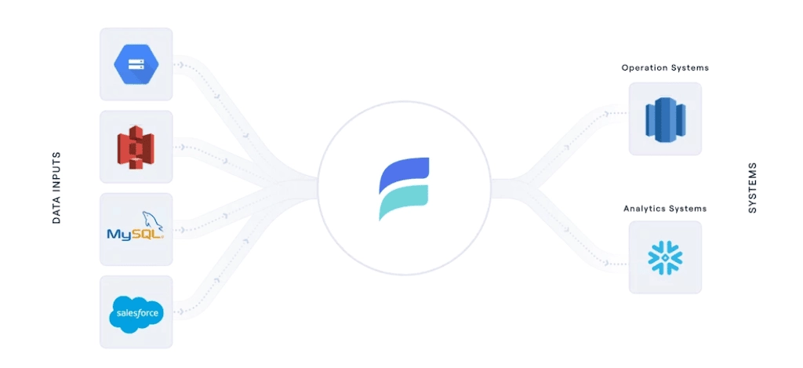

# What Is A Data Pipeline? Definition, Process, And Examples

NOTE - original post: https://estuary.dev/what-is-a-data-pipeline/

---

If you’re wondering what a data pipeline is, what processes it entails, and some examples you can look at, this article is for you. We’ll define the term and the process and cover some examples.

By the end of this article, you’ll have a more in-depth knowledge of data pipelines and a better understanding of their use cases.

## Who are Data Pipeline Stakeholders?

Before we dive in further, let’s discuss who you are, and why you might be reading this article.

Creating and managing data pipelines is highly technical. At first glance, it might seem that only technical experts need to know about them — but this isn’t the case.

Actually, a wide range of stakeholders throughout a business can benefit from knowing more about data pipelines.

Data pipeline stakeholders in a company may include:

<ul><li><b>Data engineers:</b> These are technical professionals who understand data pipelines in intricate detail. They build, monitor, and maintain the pipelines.</li>
<li><b>Software engineers and IT professionals:</b> These are also technical professionals. They don’t work directly with pipelines, but their jobs are related.</li>
<li><b>Data analysts and data scientists:</b> People who depend on data to generate insights for the company.</li>
<li><b>Leadership</b>: In today’s world, data strategy can make or break a company. Understanding systems like data pipelines on a basic level is critical for leaders.</li>
<li><b>Marketing, sales, and other professionals:</b> These are the “silent majority” of data stakeholders: people who use data, but don’t have the word “data” in their titles. They may rely on data visualization, dashboards, reports, and other data products to do their job effectively.</li></ul>

You might see yourself in one of these categories, or aspire to one of them.

But whoever you are, there’s one thing that’s hard to deny from the list above: <b>It’s quite common for stakeholders to have no idea what data pipelines are</b>, but still be affected by them.

The components that make up your organization’s <b>data infrastructure</b> aren’t obvious. When all is going well, your data infrastructure is silently supporting business goals, usually under the guidance of a team of data engineers and other specialists.

But the other stakeholders need to understand what’s going on under the surface.

You’re likely here because you want a deeper understanding of how data moves in your organization. That’s awesome: when more people understand processes like data pipelines, the whole organization will be more resilient against data leaks and bottlenecks in the system.

When you’re familiar with data pipelines, you’ll be better prepared to join in the data conversation at your company. And this means you’ll help make better-informed decisions that impact your business in a variety of ways.

Now, let’s define data pipelines.

## What is a Data Pipeline?

A data pipeline is a system that takes data from its various sources and funnels it to its destination. It’s one component of an organization’s data infrastructure.

Before we go further, let’s quickly define the concept of data infrastructure. Data infrastructure simply describes the unique combination of data systems, processes, and architecture that allow data to fulfill its function in an organization.

Data pipelines are the connective tissue of this infrastructure.

Within the data infrastructure context, the sources that feed into data pipelines could be databases, SaaS apps, data streams, or data lakes. Destinations could be another database, data warehouse, or operational systems where it will be analyzed and leveraged to meet business goals.

As you’re beginning to see, data pipelines can take many forms, depending on their sources and destinations, and ultimately, on the business use case.

There truly can be no one-size-fits-all pipeline: different businesses have a wide variety of data systems, workflows, and goals. They pursue these goals with different data infrastructure setups. Data pipelines are just one piece of that.

But let’s keep it simple (because at the end of the day it is a simple concept):

As long as it moves data from point A to point B, you can call it a data pipeline.

You likely already have data pipelines in your organization, in some form. Data pipelines go by many different names.

If any of these terms sound familiar…

    ETL (extract, transform, load), or ETL pipeline
    ELT (extract, load transform), or ELT pipeline
    Data ingestion
    Data integration

…that’s your data pipeline.

In fact, in today’s world, you’d be hard-pressed to find any business of significant size that doesn’t rely on data pipelines. Just about every industry depends on rapid data processing, automation, analytics, and business intelligence.

By connecting different data systems, data pipelines serve a huge variety of business needs.

For example:

    Monitoring and analyzing financial activity to quickly check for fraud.
    Keeping track of warehouse inventory to streamline shipping and receiving.
    Capturing customer data from an online store to customize a sales experience.
    Collecting feedback to determine the success of a product, service, or campaign.

None of these workflows would be possible if you couldn’t sync data between disparate systems.

And the data volumes that must be moved are almost always massive. What we once called “big data” is now just known as “data.” It’s the norm.

Still, reckoning with petabytes of raw data and turning it into actionable information is no small feat. It’s a tremendous undertaking that companies take on every day.

So, you now know that you definitely need a data pipeline and that you may already have one (in some form). How do you determine the best way to build or optimize a data pipeline for your business?

It helps to understand a bit more about how data pipelines work.

To give an overview of how a data pipeline works, we’ll start with a simple analogy that we’ve made before on the blog. A data pipeline is like any other pipe: say, a pipe that gets water from a source (the local reservoir) and carries it to its destination (your faucet).

It may branch, or get water from multiple sources, and it actually goes to many different destinations around your home. When it’s working, you barely think about it.

To build on this analogy, you expect the water coming out of your faucet to be clean and drinkable. Along the way, it must be treated.

It’s the same with data.

Sure, some data pipelines simply move raw data from a source into storage, like a data lake. But this doesn’t scale well.

Most larger companies and enterprises use more advanced data pipeline architecture that involves basic data transformations like aggregation or re-shaping to conform with a schema.

How does this process work? Let’s break it down into steps.

Keep in mind that this is a simplification. These steps can be broken down into sub-steps and might be accomplished in a different order or using different methods.

Generally, though, we can think of the data pipeline as having three parts:
Capture from sources
