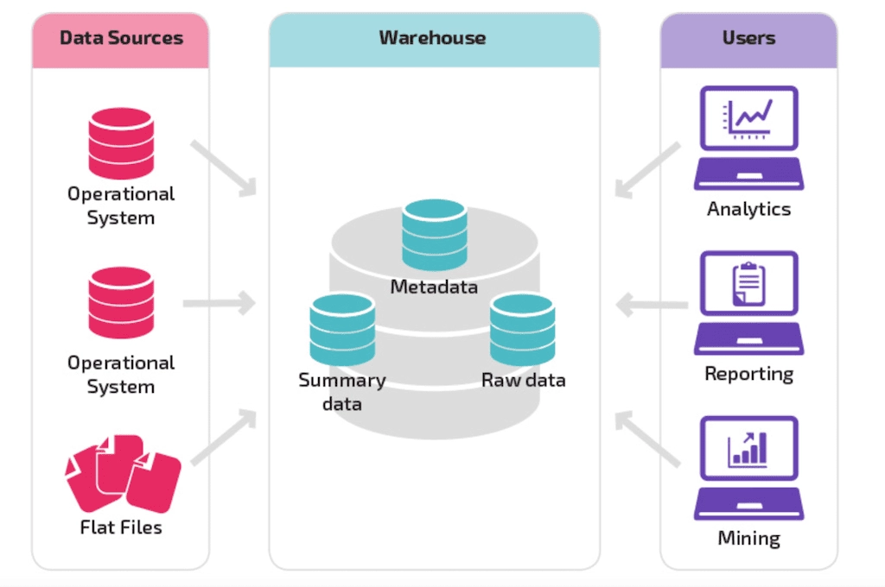
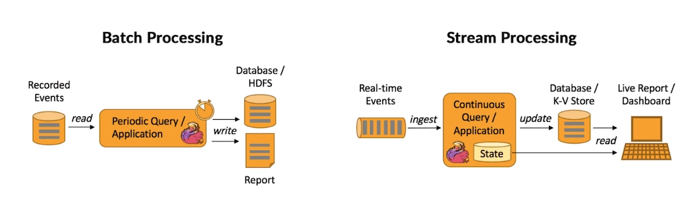
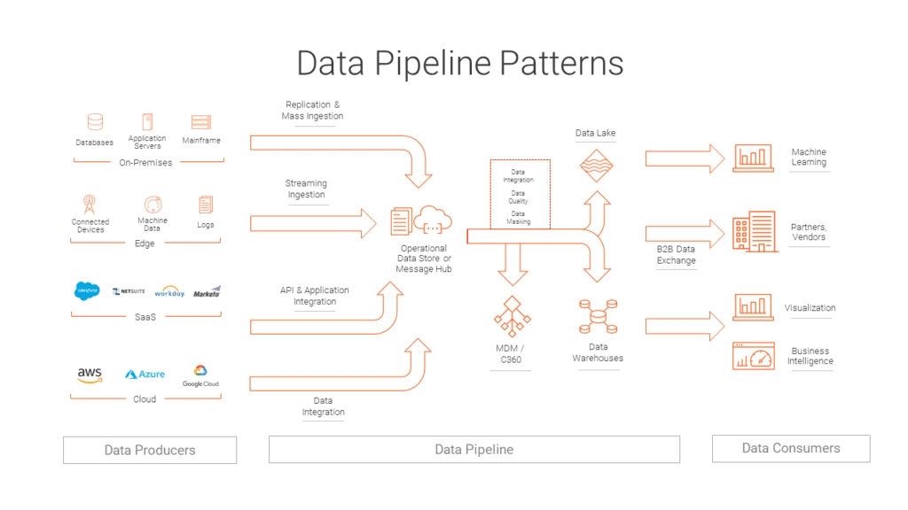

# What Is A Data Pipeline? Definition, Process, And Examples

NOTE - original post: https://estuary.dev/what-is-a-data-pipeline/

---

If you’re wondering what a data pipeline is, what processes it entails, and some examples you can look at, this article is for you. We’ll define the term and the process and cover some examples.

By the end of this article, you’ll have a more in-depth knowledge of data pipelines and a better understanding of their use cases.

## Who are Data Pipeline Stakeholders?

Before we dive in further, let’s discuss who you are, and why you might be reading this article.

Creating and managing data pipelines is highly technical. At first glance, it might seem that only technical experts need to know about them — but this isn’t the case.

Actually, a wide range of stakeholders throughout a business can benefit from knowing more about data pipelines.

Data pipeline stakeholders in a company may include:

- **Data engineers:** These are technical professionals who understand data pipelines in intricate detail. They build, monitor, and maintain the pipelines.
- **Software engineers and IT professionals:** These are also technical professionals. They don’t work directly with pipelines, but their jobs are related.
- **Data analysts and data scientists:** People who depend on data to generate insights for the company.
- **Leadership:** In today’s world, data strategy can make or break a company. Understanding systems like data pipelines on a basic level is critical for leaders.
- **Marketing, sales, and other professionals:** These are the “silent majority” of data stakeholders: people who use data, but don’t have the word “data” in their titles. They may rely on data visualization, dashboards, reports, and other data products to do their job effectively.

You might see yourself in one of these categories, or aspire to one of them.

But whoever you are, there’s one thing that’s hard to deny from the list above: **It’s quite common for stakeholders to have no idea what data pipelines are**, but still be affected by them.

The components that make up your organization’s **data infrastructure** aren’t obvious. When all is going well, your data infrastructure is silently supporting business goals, usually under the guidance of a team of data engineers and other specialists.

But the other stakeholders need to understand what’s going on under the surface.

You’re likely here because you want a deeper understanding of how data moves in your organization. That’s awesome: when more people understand processes like data pipelines, the whole organization will be more resilient against data leaks and bottlenecks in the system.

When you’re familiar with data pipelines, you’ll be better prepared to join in the data conversation at your company. And this means you’ll help make better-informed decisions that impact your business in a variety of ways.

Now, let’s define data pipelines.

## What is a Data Pipeline?

A **data pipeline** is a system that takes data from its various sources and funnels it to its destination. It’s one component of an organization’s data infrastructure.

Before we go further, let’s quickly define the concept of data infrastructure. **Data infrastructure** simply describes the unique combination of data systems, processes, and architecture that allow data to fulfill its function in an organization.

Data pipelines are the connective tissue of this infrastructure.

Within the data infrastructure context, the sources that feed into data pipelines could be databases, SaaS apps, data streams, or data lakes. Destinations could be another database, data warehouse, or operational systems where it will be analyzed and leveraged to meet business goals.

As you’re beginning to see, data pipelines can take many forms, depending on their sources and destinations, and ultimately, on the business use case.

There truly can be no one-size-fits-all pipeline: different businesses have a wide variety of data systems, workflows, and goals. They pursue these goals with different data infrastructure setups. Data pipelines are just one piece of that.

But let’s keep it simple (because at the end of the day it is a simple concept):

**As long as it moves data from point A to point B, you can call it a data pipeline.**

You likely already have data pipelines in your organization, in some form. Data pipelines go by many different names.

If any of these terms sound familiar…

- ETL (extract, transform, load), or [ETL pipeline](https://estuary.dev/what-is-an-etl-pipeline/)
- ELT (extract, load transform), or ELT pipeline
  [Data ingestion](https://estuary.dev/data-ingestion/)
- Data integration

…that’s your data pipeline.

In fact, in today’s world, you’d be hard-pressed to find any business of significant size that doesn’t rely on data pipelines. Just about every industry depends on rapid data processing, automation, analytics, and business intelligence.

By connecting different data systems, data pipelines serve a huge variety of business needs.

For example:

- Monitoring and analyzing financial activity to quickly check for fraud.
- Keeping track of warehouse inventory to streamline shipping and receiving.
- Capturing customer data from an online store to customize a sales experience.
- Collecting feedback to determine the success of a product, service, or campaign.

None of these workflows would be possible if you couldn’t sync data between disparate systems.

And the data volumes that must be moved are almost always massive. What we once called “big data” is now just known as “data.” It’s the norm.

Still, reckoning with petabytes of raw data and turning it into actionable information is no small feat. It’s a tremendous undertaking that companies take on every day.

So, you now know that you definitely need a data pipeline and that you may already have one (in some form). How do you determine the best way to build or optimize a data pipeline for your business?

It helps to understand a bit more about how data pipelines work.

A data pipeline is like any other pipe: say, a pipe that gets water from a source (the local reservoir) and carries it to its destination (your faucet).

It may branch, or get water from multiple sources, and it actually goes to many different destinations around your home. When it’s working, you barely think about it.

To build on this analogy, you expect the water coming out of your faucet to be clean and drinkable. Along the way, it must be treated.

It’s the same with data.

Sure, some data pipelines simply move raw data from a source into storage, like a data lake. But this doesn’t scale well.

Most larger companies and enterprises use more advanced data pipeline architecture that involves basic data transformations like aggregation or re-shaping to conform with a schema.

How does this process work? Let’s break it down into steps.

Keep in mind that this is a simplification. These steps can be broken down into sub-steps and might be accomplished in a different order or using different methods.

Generally, though, we can think of the data pipeline as having three parts:

## Capture from sources

**The data source is where data comes from.** Most pipelines take information from multiple sources – they can be application APIs, relational databases, CRMs, social media tools, and many more. To get an idea, check out the list of Estuary’s supported sources.

The action of ingesting data from the source is also called “extraction.”

Data can be captured in a **batch** fashion, or using **real-time**, event-based data capture. We’ll talk more about batch vs real-time data pipelines below.

## Transformation

Before data reaches its destination, it is usually combined, manipulated, and standardized according to the needs of the business.

**The transformation step is not strictly required by the basic definition of a data pipeline, but it’s extremely important in most workflows.**

It ensures that the company’s data storage systems (databases, data warehouses, or data lakes) don’t become data swamps.

In other words, it guarantees that the data in the destination is usable. Like an old-fashioned filing system, data must be shaped and stored according to a system so that it can be found and used again.

These basic data transformations have the goal of data quality and standardization. This is different from the data analytics and data science workflows that will come later.

## Destination

**The destination is the system where the data exits the pipeline.** Typically, the destination that comes to mind is the business’s data warehouse.

Warehouses are designed to handle heavy data analysis, data science, and machine learning workloads. It’s here that analysts and data scientists will build data models and turn _data_ into _information_.

However, there are many other possible destination systems: operational systems like dashboards, SaaS apps, and data visualization tools. For some examples, check out Estuary’s supported destinations.

The analytical models that analysts create in the data warehouse can be applied in production as part of a second data pipeline that goes straight from the source to operational systems.

## Monitoring

Once deployed by data engineers or other data professionals, data pipelines are automated processes that can work on their own. And well-architected data pipelines should be resilient against failure.

Still, it’s a best practice to check their performance regularly. **Catching an issue at an earlier stage can prevent excessive processing failures and delays.**

Your data engineering team might monitor your data pipeline by:

- Using the built-in functionality that comes with your data pipeline tool.
- Using a [data observability tool](https://www.montecarlodata.com/blog-what-is-data-observability/) designed to help monitor your entire data stack.
- Creating automated and/or manual tests in-house.

To do this successfully, it’s vital to have a team at the company that intimately understands the data pipeline. This includes the data pipeline architecture as well as the underlying steps of the data flow.

**This is one of the many important functions of a data engineering team.** Even if data engineers don’t spend as much time actively maintaining data pipelines [as they did in years past](https://www.estuary.dev/how-new-pipeline-tools-are-changing-data-engineering-in-the-2020s/), when pipelines do have issues, it’s extremely important that there be a team of experts on hand.

In a similar vein, this is why it’s important to [document data pipelines](https://www.estuary.dev/four-software-engineering-best-practices-to-improve-your-data-pipelines/). When you know how your pipeline should be working and how it’s constructed, it will be easier to fix it quickly when issues arise.

## 2 Common Examples Types Of Data Pipelines

As mentioned above, there’s a wide variety of types of data pipelines and data pipeline architectures. Let’s go a bit deeper into this topic and discuss the two major types of data pipelines.

### Batch Pipelines

Batch pipelines move large chunks of data — called **batches** — at regularly scheduled intervals. Data is not moved in real-time (when it appears at the source).

Instead, whenever the next batch is scheduled, the system scans the source for updates that have occurred since the previous batch.

Batch data processing is compute-intensive because each time the process is run, the entire source system must be scanned.

Because they are so heavy on the system, historically, batch workflows were put off until periods of low activity, at night, or on weekends. This is because most businesses had their own, on-premises servers, with limited computation resources and storage capacity.

Today, most companies use cloud infrastructure, so waiting for periods of low activity isn’t as much of a concern. However, batch processing can still increase costs in cloud infrastructure, and will always introduce at least some amount of latency.

**You might use a batch data pipeline if:**

- You want a pipeline that is easy for data engineers to create and manage without purchasing a pre-made solution.
- You’ve used batch pipelines historically and found that they are still working for you.
- You’re not too concerned about data latency.

In today’s world, companies are increasingly expected to react to new data instantly, which creates the need for a new type of data pipeline.

## Real-Time Pipelines

In a real-time data pipeline, data is processed almost instantly. Real-time or streaming analytics is about acquiring and formulating insights from constant flows of data within a matter of seconds.

Unlike batch processing, stream processing reacts to new events that occur in the data source, and captures them into the pipeline immediately. Because of this, it doesn’t need to scan the entire data source over and over.

This makes real-time data pipelines not only faster than batch data pipelines, but also more cost-effective.

**You might use a real-time data pipeline if:**

- Your operational systems need new data immediately.
- You are looking to save money compared to batch pipelines.
- Your datasets in source systems are very large.

Real-time data pipelines are known for being difficult to build from scratch. But in recent years, a new wave of data integration companies have appeared that specialize in making it easy to set up real-time data pipelines.

As a result, real-time data pipelines are quickly becoming more mainstream.

## Data Pipeline Use Cases

If you’re still having trouble envisioning how data pipelines are used in the real world, this section will help.

Below are the typical business processes powered by data pipelines:

### Applications

Data pipelines are vital to data-driven applications and software. These are typically programs that need to produce responses in real time.

These could be malware detectors, programs that identify malicious acts in an eCommerce transaction, updates of asset prices, inventory management programs, business intelligence dashboards, and many more.

### Data Analytics

Data pipelines often collect, clean, and transfer data to data warehouses and business intelligence applications.

Here, professionals ranging from data scientists to marketing professionals can explore, model, and transform data into actionable knowledge.

Without a data pipeline delivering fresh data regularly (or in real time), businesses would be much slower to reach their goals.

Having an automated data integration system positively affects the business outcomes of any company.

These outcomes include:

- Improved marketing conversions and sales
- Identifying challenges and problems of the target market
- A better understanding of what customers need
- Identifying business processes that could be made more efficient

### Centralization Of Data

As technology advances, companies’ data is increasingly spread out amongst numerous systems. For it to be useful, it must be aggregated.

And in the age of big data, data integration from disparate sources is just about impossible to do manually.

[Once set up](https://www.softkraft.co/automating-data-pipelines/#automating-data-pipelines-use-cases), data pipelines don’t have to be micromanaged, just monitored. For the most part, they can handle everything alone, even while your data team sleeps.

**Whether your company sells a product or service, manages finances, handles logistics, or deals in knowledge, it relies on data.**

To use that data correctly requires data integration.

And data integration is powered by pipelines.

## Conclusion

We’ve defined what a data pipeline is, and the general processes it contains. We discussed the differences between batch and real-time pipelines. And we dove into data pipeline architecture, examples, and use cases.

This article was an introduction: it won’t equip you to be a data expert or tell you how to immediately go out and build your data pipeline. But if you’re reading this article, that was probably never your goal.

Rather, understanding data pipelines — and other components of data infrastructure — will help you contribute to the conversation amongst an [interdisciplinary group of data stakeholders](https://www.estuary.dev/data-for-all-why-data-democratization-matters-at-every-scale/).

Integrating your data stack with a well-architected data pipeline can only produce positive results for your company. It can give faster turnaround times, and enable smarter decisions, in-depth analysis, and better decision-making.

We’d love to hear about your experience. How does your team use, discuss, and manage data pipelines? Let us know in the comments below.
